```python
import pandas as pd
import numpy as np

data = pd.read_csv("diabetes.csv")
data.head()

```


<div>
<style scoped>
    .dataframe tbody tr th:only-of-type {
        vertical-align: middle;
    }

    .dataframe tbody tr th {
        vertical-align: top;
    }

    .dataframe thead th {
        text-align: right;
    }
</style>
<table border="1" class="dataframe">
  <thead>
    <tr style="text-align: right;">
      <th></th>
      <th>Pregnancies</th>
      <th>Glucose</th>
      <th>BloodPressure</th>
      <th>SkinThickness</th>
      <th>Insulin</th>
      <th>BMI</th>
      <th>Pedigree</th>
      <th>Age</th>
      <th>Outcome</th>
    </tr>
  </thead>
  <tbody>
    <tr>
      <th>0</th>
      <td>6</td>
      <td>148</td>
      <td>72</td>
      <td>35</td>
      <td>0</td>
      <td>33.6</td>
      <td>0.627</td>
      <td>50</td>
      <td>1</td>
    </tr>
    <tr>
      <th>1</th>
      <td>1</td>
      <td>85</td>
      <td>66</td>
      <td>29</td>
      <td>0</td>
      <td>26.6</td>
      <td>0.351</td>
      <td>31</td>
      <td>0</td>
    </tr>
    <tr>
      <th>2</th>
      <td>8</td>
      <td>183</td>
      <td>64</td>
      <td>0</td>
      <td>0</td>
      <td>23.3</td>
      <td>0.672</td>
      <td>32</td>
      <td>1</td>
    </tr>
    <tr>
      <th>3</th>
      <td>1</td>
      <td>89</td>
      <td>66</td>
      <td>23</td>
      <td>94</td>
      <td>28.1</td>
      <td>0.167</td>
      <td>21</td>
      <td>0</td>
    </tr>
    <tr>
      <th>4</th>
      <td>0</td>
      <td>137</td>
      <td>40</td>
      <td>35</td>
      <td>168</td>
      <td>43.1</td>
      <td>2.288</td>
      <td>33</td>
      <td>1</td>
    </tr>
  </tbody>
</table>
</div>


```python
data.isnull().any()
```


    Pregnancies      False
    Glucose          False
    BloodPressure    False
    SkinThickness    False
    Insulin          False
    BMI              False
    Pedigree         False
    Age              False
    Outcome          False
    dtype: bool


```python
data.describe().T
```


<div>
<style scoped>
    .dataframe tbody tr th:only-of-type {
        vertical-align: middle;
    }

    .dataframe tbody tr th {
        vertical-align: top;
    }

    .dataframe thead th {
        text-align: right;
    }
</style>
<table border="1" class="dataframe">
  <thead>
    <tr style="text-align: right;">
      <th></th>
      <th>count</th>
      <th>mean</th>
      <th>std</th>
      <th>min</th>
      <th>25%</th>
      <th>50%</th>
      <th>75%</th>
      <th>max</th>
    </tr>
  </thead>
  <tbody>
    <tr>
      <th>Pregnancies</th>
      <td>768.0</td>
      <td>3.845052</td>
      <td>3.369578</td>
      <td>0.000</td>
      <td>1.00000</td>
      <td>3.0000</td>
      <td>6.00000</td>
      <td>17.00</td>
    </tr>
    <tr>
      <th>Glucose</th>
      <td>768.0</td>
      <td>120.894531</td>
      <td>31.972618</td>
      <td>0.000</td>
      <td>99.00000</td>
      <td>117.0000</td>
      <td>140.25000</td>
      <td>199.00</td>
    </tr>
    <tr>
      <th>BloodPressure</th>
      <td>768.0</td>
      <td>69.105469</td>
      <td>19.355807</td>
      <td>0.000</td>
      <td>62.00000</td>
      <td>72.0000</td>
      <td>80.00000</td>
      <td>122.00</td>
    </tr>
    <tr>
      <th>SkinThickness</th>
      <td>768.0</td>
      <td>20.536458</td>
      <td>15.952218</td>
      <td>0.000</td>
      <td>0.00000</td>
      <td>23.0000</td>
      <td>32.00000</td>
      <td>99.00</td>
    </tr>
    <tr>
      <th>Insulin</th>
      <td>768.0</td>
      <td>79.799479</td>
      <td>115.244002</td>
      <td>0.000</td>
      <td>0.00000</td>
      <td>30.5000</td>
      <td>127.25000</td>
      <td>846.00</td>
    </tr>
    <tr>
      <th>BMI</th>
      <td>768.0</td>
      <td>31.992578</td>
      <td>7.884160</td>
      <td>0.000</td>
      <td>27.30000</td>
      <td>32.0000</td>
      <td>36.60000</td>
      <td>67.10</td>
    </tr>
    <tr>
      <th>Pedigree</th>
      <td>768.0</td>
      <td>0.471876</td>
      <td>0.331329</td>
      <td>0.078</td>
      <td>0.24375</td>
      <td>0.3725</td>
      <td>0.62625</td>
      <td>2.42</td>
    </tr>
    <tr>
      <th>Age</th>
      <td>768.0</td>
      <td>33.240885</td>
      <td>11.760232</td>
      <td>21.000</td>
      <td>24.00000</td>
      <td>29.0000</td>
      <td>41.00000</td>
      <td>81.00</td>
    </tr>
    <tr>
      <th>Outcome</th>
      <td>768.0</td>
      <td>0.348958</td>
      <td>0.476951</td>
      <td>0.000</td>
      <td>0.00000</td>
      <td>0.0000</td>
      <td>1.00000</td>
      <td>1.00</td>
    </tr>
  </tbody>
</table>
</div>


```python
# Columns with missing values represented by zeros
columns_with_zeros = ['Glucose', 'BloodPressure', 'SkinThickness', 'Insulin', 'BMI']

# Make a deep copy of the data
data_copy = data.copy(deep=True)

# Replace zero values in specified columns with NaN to indicate missing values
data_copy[columns_with_zeros] = data_copy[columns_with_zeros].replace(0, np.nan)

# Check for missing values
data_copy.isnull().sum()

```


    Pregnancies        0
    Glucose            5
    BloodPressure     35
    SkinThickness    227
    Insulin          374
    BMI               11
    Pedigree           0
    Age                0
    Outcome            0
    dtype: int64


```python
#To fill these Nan values the data distribution needs to be understood
p = data.hist(figsize = (20,20))
```


    
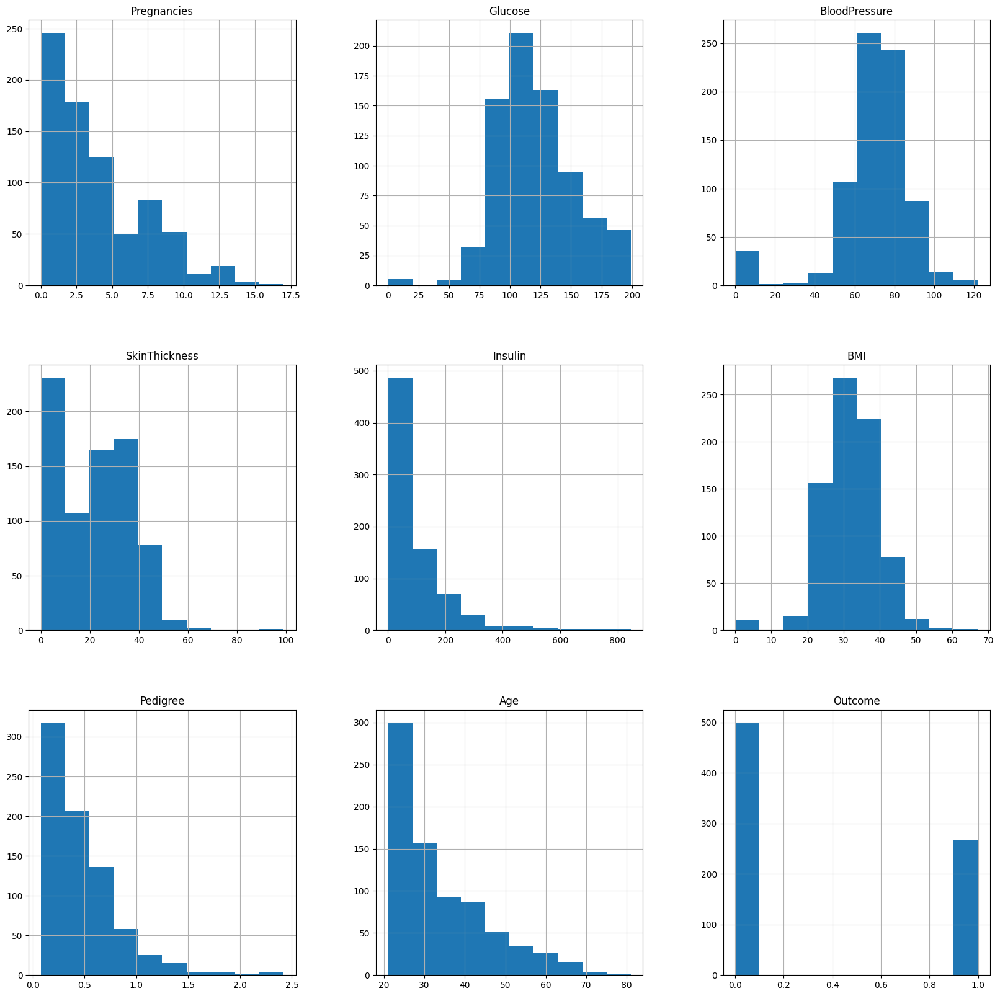
    


```python
# Replace missing values by assigning the result back to each column
data_copy['Glucose'] = data_copy['Glucose'].fillna(data_copy['Glucose'].mean())
data_copy['BloodPressure'] = data_copy['BloodPressure'].fillna(data_copy['BloodPressure'].mean())
data_copy['SkinThickness'] = data_copy['SkinThickness'].fillna(data_copy['SkinThickness'].median())
data_copy['Insulin'] = data_copy['Insulin'].fillna(data_copy['Insulin'].median())
data_copy['BMI'] = data_copy['BMI'].fillna(data_copy['BMI'].median())

```


```python
p = data_copy.hist(figsize = (20,20))

```


    
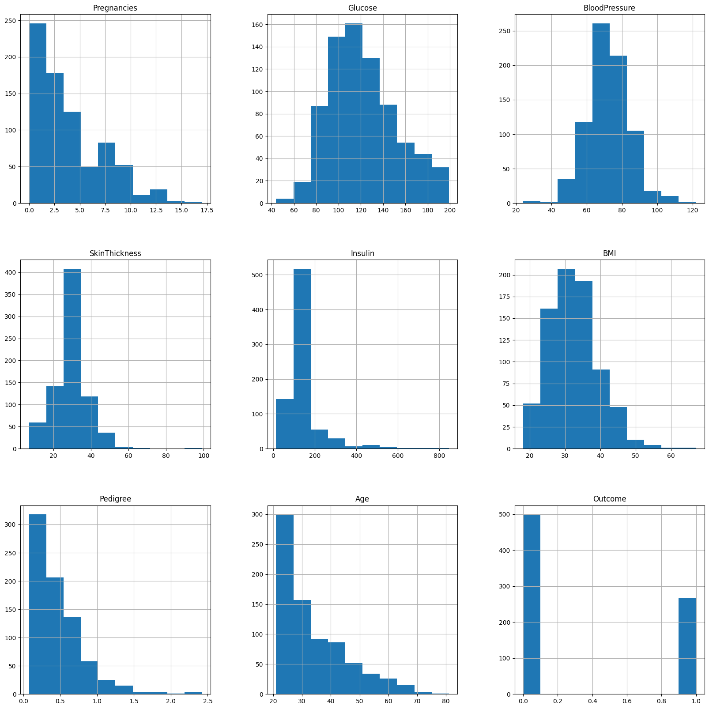
    


```python
!pip install missingno

```

    Collecting missingno
      Downloading missingno-0.5.2-py3-none-any.whl.metadata (639 bytes)
    Requirement already satisfied: numpy in c:\users\shriharsh\appdata\roaming\python\python312\site-packages (from missingno) (1.26.4)
    Requirement already satisfied: matplotlib in c:\users\shriharsh\appdata\roaming\python\python312\site-packages (from missingno) (3.8.4)
    Requirement already satisfied: scipy in c:\users\shriharsh\appdata\roaming\python\python312\site-packages (from missingno) (1.14.1)
    Requirement already satisfied: seaborn in d:\anaconda_installed_files\lib\site-packages (from missingno) (0.13.2)
    Requirement already satisfied: contourpy>=1.0.1 in c:\users\shriharsh\appdata\roaming\python\python312\site-packages (from matplotlib->missingno) (1.2.1)
    Requirement already satisfied: cycler>=0.10 in c:\users\shriharsh\appdata\roaming\python\python312\site-packages (from matplotlib->missingno) (0.12.1)
    Requirement already satisfied: fonttools>=4.22.0 in c:\users\shriharsh\appdata\roaming\python\python312\site-packages (from matplotlib->missingno) (4.51.0)
    Requirement already satisfied: kiwisolver>=1.3.1 in c:\users\shriharsh\appdata\roaming\python\python312\site-packages (from matplotlib->missingno) (1.4.5)
    Requirement already satisfied: packaging>=20.0 in c:\users\shriharsh\appdata\roaming\python\python312\site-packages (from matplotlib->missingno) (24.0)
    Requirement already satisfied: pillow>=8 in c:\users\shriharsh\appdata\roaming\python\python312\site-packages (from matplotlib->missingno) (10.3.0)
    Requirement already satisfied: pyparsing>=2.3.1 in c:\users\shriharsh\appdata\roaming\python\python312\site-packages (from matplotlib->missingno) (3.1.2)
    Requirement already satisfied: python-dateutil>=2.7 in c:\users\shriharsh\appdata\roaming\python\python312\site-packages (from matplotlib->missingno) (2.9.0.post0)
    Requirement already satisfied: pandas>=1.2 in c:\users\shriharsh\appdata\roaming\python\python312\site-packages (from seaborn->missingno) (2.2.2)
    Requirement already satisfied: pytz>=2020.1 in c:\users\shriharsh\appdata\roaming\python\python312\site-packages (from pandas>=1.2->seaborn->missingno) (2024.1)
    Requirement already satisfied: tzdata>=2022.7 in c:\users\shriharsh\appdata\roaming\python\python312\site-packages (from pandas>=1.2->seaborn->missingno) (2024.1)
    Requirement already satisfied: six>=1.5 in c:\users\shriharsh\appdata\roaming\python\python312\site-packages (from python-dateutil>=2.7->matplotlib->missingno) (1.16.0)
    Downloading missingno-0.5.2-py3-none-any.whl (8.7 kB)
    Installing collected packages: missingno
    Successfully installed missingno-0.5.2
    

    WARNING: Skipping C:\Users\Shriharsh\AppData\Roaming\Python\Python312\site-packages\absl_py-2.1.0.dist-info due to invalid metadata entry 'name'
    WARNING: Skipping C:\Users\Shriharsh\AppData\Roaming\Python\Python312\site-packages\ml_dtypes-0.5.0.dist-info due to invalid metadata entry 'name'
    WARNING: Skipping C:\Users\Shriharsh\AppData\Roaming\Python\Python312\site-packages\opencv_contrib_python-4.10.0.84.dist-info due to invalid metadata entry 'name'
    WARNING: Skipping C:\Users\Shriharsh\AppData\Roaming\Python\Python312\site-packages\opt_einsum-3.4.0.dist-info due to invalid metadata entry 'name'
    WARNING: Skipping C:\Users\Shriharsh\AppData\Roaming\Python\Python312\site-packages\sounddevice-0.5.1.dist-info due to invalid metadata entry 'name'
    WARNING: Skipping C:\Users\Shriharsh\AppData\Roaming\Python\Python312\site-packages\absl_py-2.1.0.dist-info due to invalid metadata entry 'name'
    WARNING: Skipping C:\Users\Shriharsh\AppData\Roaming\Python\Python312\site-packages\ml_dtypes-0.5.0.dist-info due to invalid metadata entry 'name'
    WARNING: Skipping C:\Users\Shriharsh\AppData\Roaming\Python\Python312\site-packages\opencv_contrib_python-4.10.0.84.dist-info due to invalid metadata entry 'name'
    WARNING: Skipping C:\Users\Shriharsh\AppData\Roaming\Python\Python312\site-packages\opt_einsum-3.4.0.dist-info due to invalid metadata entry 'name'
    WARNING: Skipping C:\Users\Shriharsh\AppData\Roaming\Python\Python312\site-packages\sounddevice-0.5.1.dist-info due to invalid metadata entry 'name'
    WARNING: Skipping C:\Users\Shriharsh\AppData\Roaming\Python\Python312\site-packages\absl_py-2.1.0.dist-info due to invalid metadata entry 'name'
    WARNING: Skipping C:\Users\Shriharsh\AppData\Roaming\Python\Python312\site-packages\ml_dtypes-0.5.0.dist-info due to invalid metadata entry 'name'
    WARNING: Skipping C:\Users\Shriharsh\AppData\Roaming\Python\Python312\site-packages\opencv_contrib_python-4.10.0.84.dist-info due to invalid metadata entry 'name'
    WARNING: Skipping C:\Users\Shriharsh\AppData\Roaming\Python\Python312\site-packages\opt_einsum-3.4.0.dist-info due to invalid metadata entry 'name'
    WARNING: Skipping C:\Users\Shriharsh\AppData\Roaming\Python\Python312\site-packages\sounddevice-0.5.1.dist-info due to invalid metadata entry 'name'
    WARNING: Skipping C:\Users\Shriharsh\AppData\Roaming\Python\Python312\site-packages\absl_py-2.1.0.dist-info due to invalid metadata entry 'name'
    WARNING: Skipping C:\Users\Shriharsh\AppData\Roaming\Python\Python312\site-packages\ml_dtypes-0.5.0.dist-info due to invalid metadata entry 'name'
    WARNING: Skipping C:\Users\Shriharsh\AppData\Roaming\Python\Python312\site-packages\opencv_contrib_python-4.10.0.84.dist-info due to invalid metadata entry 'name'
    WARNING: Skipping C:\Users\Shriharsh\AppData\Roaming\Python\Python312\site-packages\opt_einsum-3.4.0.dist-info due to invalid metadata entry 'name'
    WARNING: Skipping C:\Users\Shriharsh\AppData\Roaming\Python\Python312\site-packages\sounddevice-0.5.1.dist-info due to invalid metadata entry 'name'
    WARNING: Skipping C:\Users\Shriharsh\AppData\Roaming\Python\Python312\site-packages\absl_py-2.1.0.dist-info due to invalid metadata entry 'name'
    WARNING: Skipping C:\Users\Shriharsh\AppData\Roaming\Python\Python312\site-packages\ml_dtypes-0.5.0.dist-info due to invalid metadata entry 'name'
    WARNING: Skipping C:\Users\Shriharsh\AppData\Roaming\Python\Python312\site-packages\opencv_contrib_python-4.10.0.84.dist-info due to invalid metadata entry 'name'
    WARNING: Skipping C:\Users\Shriharsh\AppData\Roaming\Python\Python312\site-packages\opt_einsum-3.4.0.dist-info due to invalid metadata entry 'name'
    WARNING: Skipping C:\Users\Shriharsh\AppData\Roaming\Python\Python312\site-packages\sounddevice-0.5.1.dist-info due to invalid metadata entry 'name'
    WARNING: Skipping C:\Users\Shriharsh\AppData\Roaming\Python\Python312\site-packages\absl_py-2.1.0.dist-info due to invalid metadata entry 'name'
    WARNING: Skipping C:\Users\Shriharsh\AppData\Roaming\Python\Python312\site-packages\ml_dtypes-0.5.0.dist-info due to invalid metadata entry 'name'
    WARNING: Skipping C:\Users\Shriharsh\AppData\Roaming\Python\Python312\site-packages\opencv_contrib_python-4.10.0.84.dist-info due to invalid metadata entry 'name'
    WARNING: Skipping C:\Users\Shriharsh\AppData\Roaming\Python\Python312\site-packages\opt_einsum-3.4.0.dist-info due to invalid metadata entry 'name'
    WARNING: Skipping C:\Users\Shriharsh\AppData\Roaming\Python\Python312\site-packages\sounddevice-0.5.1.dist-info due to invalid metadata entry 'name'
    


```python
import missingno as msno
p = msno.bar(data)

```


    
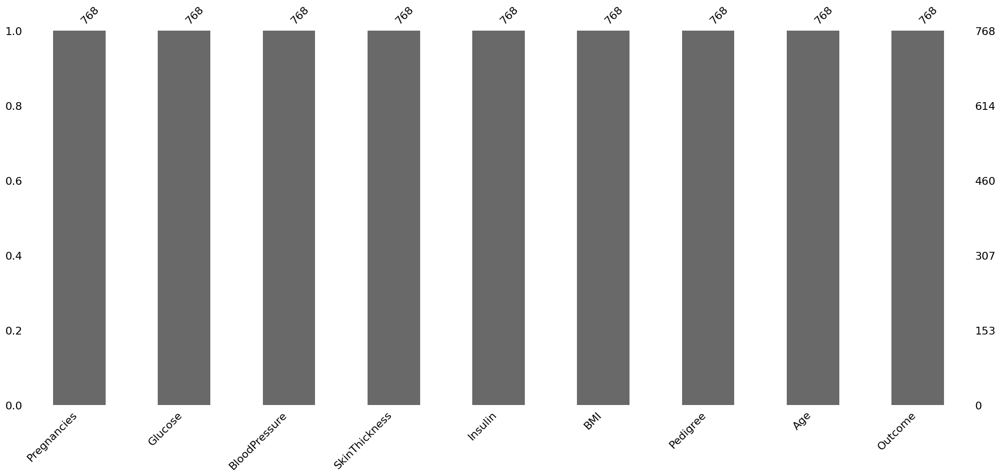
    


```python
p=data.Outcome.value_counts().plot(kind="bar")
```


    
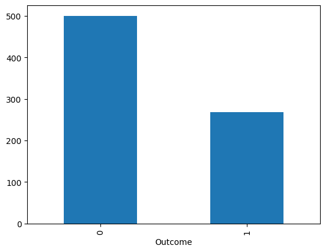
    


```python
#The above graph shows that the data is biased towards datapoints having outcome value as 0 where it means that diabetes was not present actually. The number of non-diabetics is almost twice the number of diabetic patients

import seaborn as sns
p=sns.pairplot(data_copy, hue = 'Outcome')

```


    
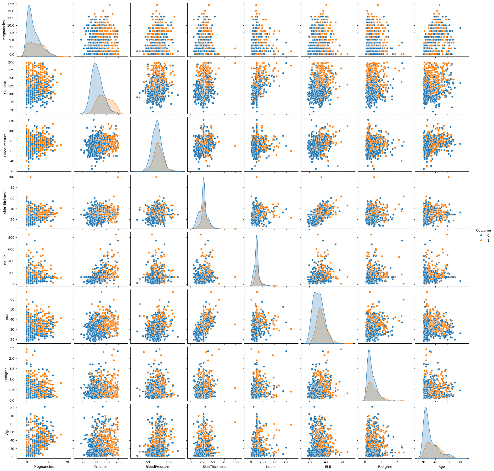
    


```python
import matplotlib.pyplot as plt
plt.figure(figsize=(12,10)) # on this line I just set the size of figure to 12 by 10.
p=sns.heatmap(data.corr(), annot=True,cmap ='RdYlGn') # seaborn has very simple solution for heatmap
```


    
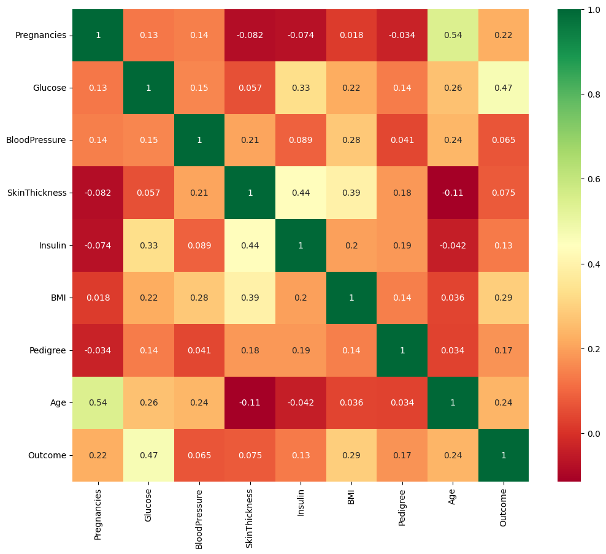
    


```python
plt.figure(figsize=(12,10)) # on this line I just set the size of figure to 12 by 10.
p=sns.heatmap(data_copy.corr(), annot=True,cmap ='RdYlGn') # seaborn has very simple solution for heatmap
```


    
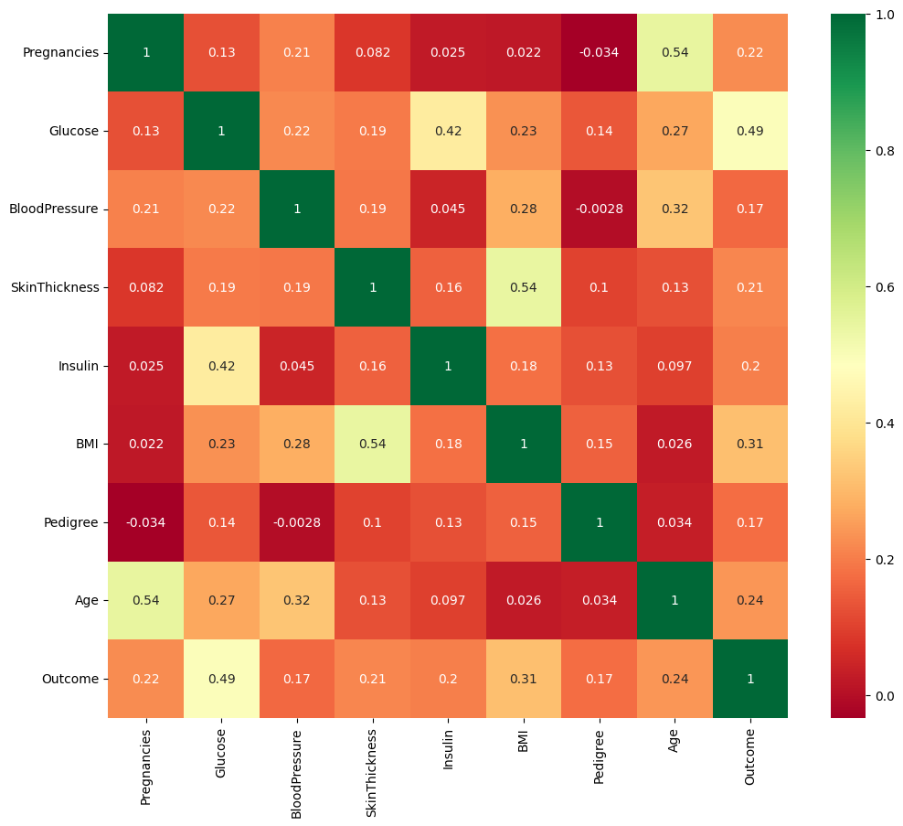
    


```python
from sklearn.preprocessing import StandardScaler
sc_X = StandardScaler()
X = pd.DataFrame(sc_X.fit_transform(data_copy.drop(["Outcome"], axis=1)),
                 columns=['Pregnancies', 'Glucose', 'BloodPressure', 'SkinThickness', 'Insulin', 'BMI', 'DiabetesPedigreeFunction', 'Age'])
X.head()
```


<div>
<style scoped>
    .dataframe tbody tr th:only-of-type {
        vertical-align: middle;
    }

    .dataframe tbody tr th {
        vertical-align: top;
    }

    .dataframe thead th {
        text-align: right;
    }
</style>
<table border="1" class="dataframe">
  <thead>
    <tr style="text-align: right;">
      <th></th>
      <th>Pregnancies</th>
      <th>Glucose</th>
      <th>BloodPressure</th>
      <th>SkinThickness</th>
      <th>Insulin</th>
      <th>BMI</th>
      <th>DiabetesPedigreeFunction</th>
      <th>Age</th>
    </tr>
  </thead>
  <tbody>
    <tr>
      <th>0</th>
      <td>0.639947</td>
      <td>0.865108</td>
      <td>-0.033518</td>
      <td>0.670643</td>
      <td>-0.181541</td>
      <td>0.166619</td>
      <td>0.468492</td>
      <td>1.425995</td>
    </tr>
    <tr>
      <th>1</th>
      <td>-0.844885</td>
      <td>-1.206162</td>
      <td>-0.529859</td>
      <td>-0.012301</td>
      <td>-0.181541</td>
      <td>-0.852200</td>
      <td>-0.365061</td>
      <td>-0.190672</td>
    </tr>
    <tr>
      <th>2</th>
      <td>1.233880</td>
      <td>2.015813</td>
      <td>-0.695306</td>
      <td>-0.012301</td>
      <td>-0.181541</td>
      <td>-1.332500</td>
      <td>0.604397</td>
      <td>-0.105584</td>
    </tr>
    <tr>
      <th>3</th>
      <td>-0.844885</td>
      <td>-1.074652</td>
      <td>-0.529859</td>
      <td>-0.695245</td>
      <td>-0.540642</td>
      <td>-0.633881</td>
      <td>-0.920763</td>
      <td>-1.041549</td>
    </tr>
    <tr>
      <th>4</th>
      <td>-1.141852</td>
      <td>0.503458</td>
      <td>-2.680669</td>
      <td>0.670643</td>
      <td>0.316566</td>
      <td>1.549303</td>
      <td>5.484909</td>
      <td>-0.020496</td>
    </tr>
  </tbody>
</table>
</div>


```python
# Define the target variable
y = data_copy['Outcome']

# Split the dataset into training and testing sets
from sklearn.model_selection import train_test_split
X_train, X_test, y_train, y_test = train_test_split(X, y, test_size=1/3, random_state=42, stratify=y)

# Import KNeighborsClassifier
from sklearn.neighbors import KNeighborsClassifier

# Lists to store train and test scores
train_scores = []
test_scores = []

# Loop through different values of k (neighbors)
for i in range(1, 15):
    # Initialize the KNN classifier with i neighbors
    knn = KNeighborsClassifier(n_neighbors=i)
    
    # Fit the model on the training data
    knn.fit(X_train, y_train)
    
    # Append the training score to train_scores
    train_scores.append(knn.score(X_train, y_train))
    
    # Append the testing score to test_scores
    test_scores.append(knn.score(X_test, y_test))

# Calculate the maximum test score and the corresponding k values
max_test_score = max(test_scores)
test_score_index = [i for i, v in enumerate(test_scores) if v == max_test_score]

# Print the maximum test score and corresponding k values
print('Max test score: {:.2f}% and k = {}'.format(max_test_score * 100, list(map(lambda x: x + 1, test_score_index))))

```

    Max test score: 76.56% and k = [11]
    


```python
plt.figure(figsize=(12,5))
plt.figure(figsize=(12, 5))
p = sns.lineplot(x=range(1, 15), y=train_scores, marker='*', label='Train Score')
p = sns.lineplot(x=range(1, 15), y=test_scores, marker='o', label='Test Score')
plt.xlabel('Number of Neighbors (k)')
plt.ylabel('Score')
plt.title('Train vs Test Scores for Different k values in KNN')
plt.legend()
plt.show()
```


    <Figure size 1200x500 with 0 Axes>


    
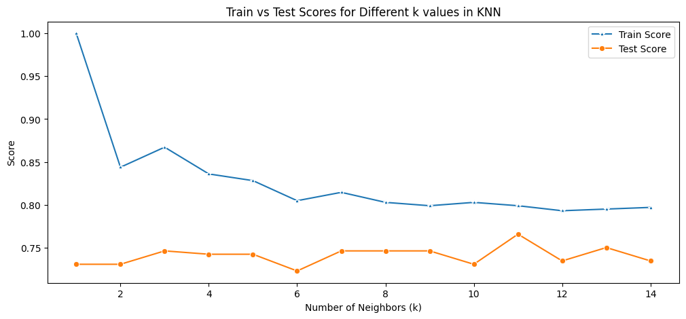
    


```python
# K=11
#Setup a knn classifier with k neighbors
knn = KNeighborsClassifier(11)
knn.fit(X_train,y_train)
knn.score(X_test,y_test)
```


    0.765625


```python
!pip install mlxtend
```

    Collecting mlxtend
      Downloading mlxtend-0.23.2-py3-none-any.whl.metadata (7.3 kB)
    Requirement already satisfied: scipy>=1.2.1 in c:\users\shriharsh\appdata\roaming\python\python312\site-packages (from mlxtend) (1.14.1)
    Requirement already satisfied: numpy>=1.16.2 in c:\users\shriharsh\appdata\roaming\python\python312\site-packages (from mlxtend) (1.26.4)
    Requirement already satisfied: pandas>=0.24.2 in c:\users\shriharsh\appdata\roaming\python\python312\site-packages (from mlxtend) (2.2.2)
    Requirement already satisfied: scikit-learn>=1.3.1 in d:\anaconda_installed_files\lib\site-packages (from mlxtend) (1.4.2)
    Requirement already satisfied: matplotlib>=3.0.0 in c:\users\shriharsh\appdata\roaming\python\python312\site-packages (from mlxtend) (3.8.4)
    Requirement already satisfied: joblib>=0.13.2 in d:\anaconda_installed_files\lib\site-packages (from mlxtend) (1.4.2)
    Requirement already satisfied: contourpy>=1.0.1 in c:\users\shriharsh\appdata\roaming\python\python312\site-packages (from matplotlib>=3.0.0->mlxtend) (1.2.1)
    Requirement already satisfied: cycler>=0.10 in c:\users\shriharsh\appdata\roaming\python\python312\site-packages (from matplotlib>=3.0.0->mlxtend) (0.12.1)
    Requirement already satisfied: fonttools>=4.22.0 in c:\users\shriharsh\appdata\roaming\python\python312\site-packages (from matplotlib>=3.0.0->mlxtend) (4.51.0)
    Requirement already satisfied: kiwisolver>=1.3.1 in c:\users\shriharsh\appdata\roaming\python\python312\site-packages (from matplotlib>=3.0.0->mlxtend) (1.4.5)
    Requirement already satisfied: packaging>=20.0 in c:\users\shriharsh\appdata\roaming\python\python312\site-packages (from matplotlib>=3.0.0->mlxtend) (24.0)
    Requirement already satisfied: pillow>=8 in c:\users\shriharsh\appdata\roaming\python\python312\site-packages (from matplotlib>=3.0.0->mlxtend) (10.3.0)
    Requirement already satisfied: pyparsing>=2.3.1 in c:\users\shriharsh\appdata\roaming\python\python312\site-packages (from matplotlib>=3.0.0->mlxtend) (3.1.2)
    Requirement already satisfied: python-dateutil>=2.7 in c:\users\shriharsh\appdata\roaming\python\python312\site-packages (from matplotlib>=3.0.0->mlxtend) (2.9.0.post0)
    Requirement already satisfied: pytz>=2020.1 in c:\users\shriharsh\appdata\roaming\python\python312\site-packages (from pandas>=0.24.2->mlxtend) (2024.1)
    Requirement already satisfied: tzdata>=2022.7 in c:\users\shriharsh\appdata\roaming\python\python312\site-packages (from pandas>=0.24.2->mlxtend) (2024.1)
    Requirement already satisfied: threadpoolctl>=2.0.0 in d:\anaconda_installed_files\lib\site-packages (from scikit-learn>=1.3.1->mlxtend) (2.2.0)
    Requirement already satisfied: six>=1.5 in c:\users\shriharsh\appdata\roaming\python\python312\site-packages (from python-dateutil>=2.7->matplotlib>=3.0.0->mlxtend) (1.16.0)
    Downloading mlxtend-0.23.2-py3-none-any.whl (1.4 MB)
       ---------------------------------------- 0.0/1.4 MB ? eta -:--:--
       ---------------------------------------- 0.0/1.4 MB ? eta -:--:--
       ---------------------------------------- 0.0/1.4 MB ? eta -:--:--
       - -------------------------------------- 0.0/1.4 MB 330.3 kB/s eta 0:00:04
       -- ------------------------------------- 0.1/1.4 MB 573.4 kB/s eta 0:00:03
       ---- ----------------------------------- 0.2/1.4 MB 898.2 kB/s eta 0:00:02
       ------ --------------------------------- 0.2/1.4 MB 1.0 MB/s eta 0:00:02
       --------- ------------------------------ 0.3/1.4 MB 1.3 MB/s eta 0:00:01
       ----------- ---------------------------- 0.4/1.4 MB 1.3 MB/s eta 0:00:01
       ------------- -------------------------- 0.4/1.4 MB 1.3 MB/s eta 0:00:01
       --------------- ------------------------ 0.5/1.4 MB 1.4 MB/s eta 0:00:01
       ----------------- ---------------------- 0.6/1.4 MB 1.5 MB/s eta 0:00:01
       -------------------- ------------------- 0.7/1.4 MB 1.5 MB/s eta 0:00:01
       ---------------------- ----------------- 0.8/1.4 MB 1.6 MB/s eta 0:00:01
       ------------------------- -------------- 0.8/1.4 MB 1.6 MB/s eta 0:00:01
       ---------------------------- ----------- 1.0/1.4 MB 1.6 MB/s eta 0:00:01
       ------------------------------- -------- 1.1/1.4 MB 1.7 MB/s eta 0:00:01
       ----------------------------------- ---- 1.2/1.4 MB 1.8 MB/s eta 0:00:01
       ------------------------------------- -- 1.3/1.4 MB 1.8 MB/s eta 0:00:01
       ---------------------------------------  1.4/1.4 MB 1.8 MB/s eta 0:00:01
       ---------------------------------------- 1.4/1.4 MB 1.8 MB/s eta 0:00:00
    Installing collected packages: mlxtend
    Successfully installed mlxtend-0.23.2
    

    WARNING: Skipping C:\Users\Shriharsh\AppData\Roaming\Python\Python312\site-packages\absl_py-2.1.0.dist-info due to invalid metadata entry 'name'
    WARNING: Skipping C:\Users\Shriharsh\AppData\Roaming\Python\Python312\site-packages\ml_dtypes-0.5.0.dist-info due to invalid metadata entry 'name'
    WARNING: Skipping C:\Users\Shriharsh\AppData\Roaming\Python\Python312\site-packages\opencv_contrib_python-4.10.0.84.dist-info due to invalid metadata entry 'name'
    WARNING: Skipping C:\Users\Shriharsh\AppData\Roaming\Python\Python312\site-packages\opt_einsum-3.4.0.dist-info due to invalid metadata entry 'name'
    WARNING: Skipping C:\Users\Shriharsh\AppData\Roaming\Python\Python312\site-packages\sounddevice-0.5.1.dist-info due to invalid metadata entry 'name'
    WARNING: Skipping C:\Users\Shriharsh\AppData\Roaming\Python\Python312\site-packages\absl_py-2.1.0.dist-info due to invalid metadata entry 'name'
    WARNING: Skipping C:\Users\Shriharsh\AppData\Roaming\Python\Python312\site-packages\ml_dtypes-0.5.0.dist-info due to invalid metadata entry 'name'
    WARNING: Skipping C:\Users\Shriharsh\AppData\Roaming\Python\Python312\site-packages\opencv_contrib_python-4.10.0.84.dist-info due to invalid metadata entry 'name'
    WARNING: Skipping C:\Users\Shriharsh\AppData\Roaming\Python\Python312\site-packages\opt_einsum-3.4.0.dist-info due to invalid metadata entry 'name'
    WARNING: Skipping C:\Users\Shriharsh\AppData\Roaming\Python\Python312\site-packages\sounddevice-0.5.1.dist-info due to invalid metadata entry 'name'
    WARNING: Skipping C:\Users\Shriharsh\AppData\Roaming\Python\Python312\site-packages\absl_py-2.1.0.dist-info due to invalid metadata entry 'name'
    WARNING: Skipping C:\Users\Shriharsh\AppData\Roaming\Python\Python312\site-packages\ml_dtypes-0.5.0.dist-info due to invalid metadata entry 'name'
    WARNING: Skipping C:\Users\Shriharsh\AppData\Roaming\Python\Python312\site-packages\opencv_contrib_python-4.10.0.84.dist-info due to invalid metadata entry 'name'
    WARNING: Skipping C:\Users\Shriharsh\AppData\Roaming\Python\Python312\site-packages\opt_einsum-3.4.0.dist-info due to invalid metadata entry 'name'
    WARNING: Skipping C:\Users\Shriharsh\AppData\Roaming\Python\Python312\site-packages\sounddevice-0.5.1.dist-info due to invalid metadata entry 'name'
    WARNING: Skipping C:\Users\Shriharsh\AppData\Roaming\Python\Python312\site-packages\absl_py-2.1.0.dist-info due to invalid metadata entry 'name'
    WARNING: Skipping C:\Users\Shriharsh\AppData\Roaming\Python\Python312\site-packages\ml_dtypes-0.5.0.dist-info due to invalid metadata entry 'name'
    WARNING: Skipping C:\Users\Shriharsh\AppData\Roaming\Python\Python312\site-packages\opencv_contrib_python-4.10.0.84.dist-info due to invalid metadata entry 'name'
    WARNING: Skipping C:\Users\Shriharsh\AppData\Roaming\Python\Python312\site-packages\opt_einsum-3.4.0.dist-info due to invalid metadata entry 'name'
    WARNING: Skipping C:\Users\Shriharsh\AppData\Roaming\Python\Python312\site-packages\sounddevice-0.5.1.dist-info due to invalid metadata entry 'name'
    WARNING: Skipping C:\Users\Shriharsh\AppData\Roaming\Python\Python312\site-packages\absl_py-2.1.0.dist-info due to invalid metadata entry 'name'
    WARNING: Skipping C:\Users\Shriharsh\AppData\Roaming\Python\Python312\site-packages\ml_dtypes-0.5.0.dist-info due to invalid metadata entry 'name'
    WARNING: Skipping C:\Users\Shriharsh\AppData\Roaming\Python\Python312\site-packages\opencv_contrib_python-4.10.0.84.dist-info due to invalid metadata entry 'name'
    WARNING: Skipping C:\Users\Shriharsh\AppData\Roaming\Python\Python312\site-packages\opt_einsum-3.4.0.dist-info due to invalid metadata entry 'name'
    WARNING: Skipping C:\Users\Shriharsh\AppData\Roaming\Python\Python312\site-packages\sounddevice-0.5.1.dist-info due to invalid metadata entry 'name'
    WARNING: Skipping C:\Users\Shriharsh\AppData\Roaming\Python\Python312\site-packages\absl_py-2.1.0.dist-info due to invalid metadata entry 'name'
    WARNING: Skipping C:\Users\Shriharsh\AppData\Roaming\Python\Python312\site-packages\ml_dtypes-0.5.0.dist-info due to invalid metadata entry 'name'
    WARNING: Skipping C:\Users\Shriharsh\AppData\Roaming\Python\Python312\site-packages\opencv_contrib_python-4.10.0.84.dist-info due to invalid metadata entry 'name'
    WARNING: Skipping C:\Users\Shriharsh\AppData\Roaming\Python\Python312\site-packages\opt_einsum-3.4.0.dist-info due to invalid metadata entry 'name'
    WARNING: Skipping C:\Users\Shriharsh\AppData\Roaming\Python\Python312\site-packages\sounddevice-0.5.1.dist-info due to invalid metadata entry 'name'
    


```python
from mlxtend.plotting import plot_decision_regions
import matplotlib.pyplot as plt

# Set the values for the filler feature values and ranges
value = 20000
width = 20000

# Pass the DataFrame `X` directly to plot_decision_regions
plot_decision_regions(X.values, y.values, clf = knn, legend =2,filler_feature_values={2: value, 3: value, 4: value, 5: value, 6: value, 7: value},
filler_feature_ranges={2: width, 3: width, 4: width, 5: width, 6: width, 7: width},
X_highlight=X_test.values)


# Add title and show the plot
plt.title("KNN with Diabetes Data")
plt.show()

```

    D:\Anaconda_installed_Files\Lib\site-packages\sklearn\base.py:493: UserWarning: X does not have valid feature names, but KNeighborsClassifier was fitted with feature names
      warnings.warn(
    


    
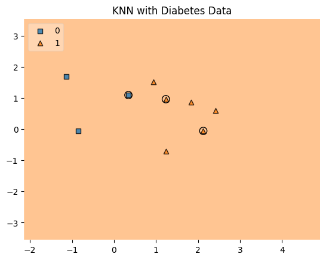
    


```python
from sklearn.metrics import confusion_matrix
from sklearn.metrics import accuracy_score, precision_score, recall_score, f1_score, fbeta_score
y_pred = knn.predict(X_test)
cnf_matrix = confusion_matrix(y_test, y_pred)
p = sns.heatmap(pd.DataFrame(cnf_matrix), annot=True, cmap="YlGnBu" ,fmt='g')
plt.title('Confusion matrix', y=1.1)
plt.ylabel('Actual label')
plt.xlabel('Predicted label')
```


    Text(0.5, 23.52222222222222, 'Predicted label')


    
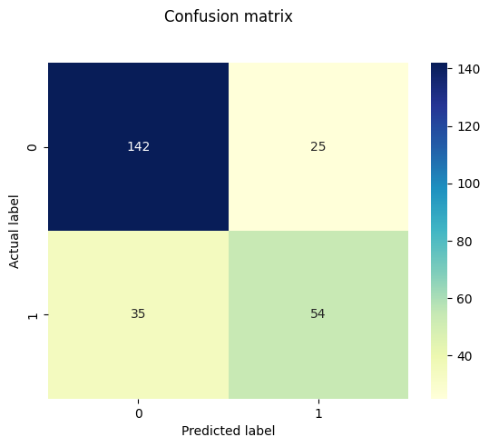
    


```python
from sklearn.metrics import accuracy_score, precision_score, recall_score, f1_score, fbeta_score
import pandas as pd

# Define the function with proper indentation
def model_evaluation(y_test, y_pred, model_name):
    acc = accuracy_score(y_test, y_pred)  # Indented inside the function
    prec = precision_score(y_test, y_pred)
    rec = recall_score(y_test, y_pred)
    f1 = f1_score(y_test, y_pred)
    f2 = fbeta_score(y_test, y_pred, beta=2.0)
    
    # Creating the results DataFrame
    results = pd.DataFrame([[model_name, acc, prec, rec, f1, f2]],
                           columns=["Model", "Accuracy", "Precision", "Recall", "F1 Score", "F2 Score"])
    
    # Sorting the DataFrame by Precision, Recall, and F2 Score
    results = results.sort_values(["Precision", "Recall", "F2 Score"], ascending=False)
    
    return results

# Example usage of the function
results = model_evaluation(y_test, y_pred, "KNN")
print(results)

```

      Model  Accuracy  Precision    Recall  F1 Score  F2 Score
    0   KNN  0.765625   0.683544  0.606742  0.642857   0.62069
    


```python
# Alternate way
from sklearn.metrics import classification_report
print(classification_report(y_test,y_pred))
```

                  precision    recall  f1-score   support
    
               0       0.80      0.85      0.83       167
               1       0.68      0.61      0.64        89
    
        accuracy                           0.77       256
       macro avg       0.74      0.73      0.73       256
    weighted avg       0.76      0.77      0.76       256
    
    


```python
from sklearn.metrics import auc, roc_auc_score, roc_curve
y_pred_proba = knn.predict_proba(X_test)[:,-1]
fpr, tpr, threshold = roc_curve(y_test, y_pred_proba)
classifier_roc_auc = roc_auc_score(y_test, y_pred_proba)
plt.plot([0,1],[0,1], label = "---")
plt.plot(fpr, tpr, label ='KNN (area = %0.2f)' % classifier_roc_auc)
plt.xlabel("fpr")
plt.ylabel("tpr")
plt.title('Knn(n_neighbors=11) ROC curve')
plt.legend(loc="lower right", fontsize = "medium")
plt.xticks(rotation=0, horizontalalignment="center")
plt.yticks(rotation=0, horizontalalignment="right")

```


    (array([-0.2,  0. ,  0.2,  0.4,  0.6,  0.8,  1. ,  1.2]),
     [Text(0, -0.2, '−0.2'),
      Text(0, 0.0, '0.0'),
      Text(0, 0.2, '0.2'),
      Text(0, 0.4000000000000001, '0.4'),
      Text(0, 0.6000000000000001, '0.6'),
      Text(0, 0.8, '0.8'),
      Text(0, 1.0000000000000002, '1.0'),
      Text(0, 1.2000000000000002, '1.2')])


    
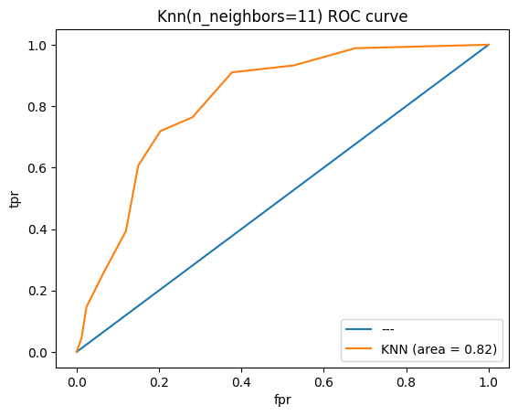
    


```python
from sklearn.model_selection import GridSearchCV
import numpy as np
from sklearn.neighbors import KNeighborsClassifier

# Correct the parameter grid: n_neighbors must be >= 1
parameters_grid = {"n_neighbors": np.arange(1, 51)}  # n_neighbors should start from 1

# Initialize the KNeighborsClassifier
knn = KNeighborsClassifier()

# Initialize GridSearchCV with 5-fold cross-validation
knn_GSV = GridSearchCV(knn, param_grid=parameters_grid, cv=5)

# Fit the model
knn_GSV.fit(X, y)

# Optionally, print the best parameters and score
print("Best parameters found: ", knn_GSV.best_params_)
print("Best cross-validation score: {:.2f}".format(knn_GSV.best_score_))

```

    Best parameters found:  {'n_neighbors': 25}
    Best cross-validation score: 0.77
    


```python

```
