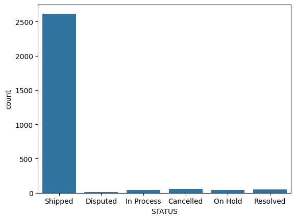
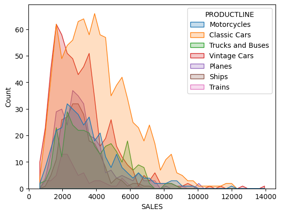
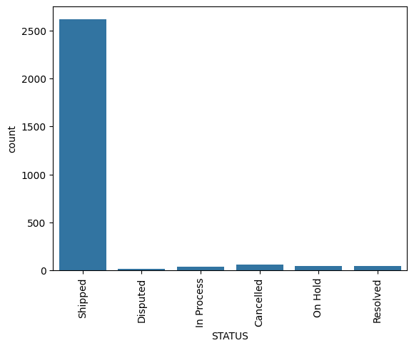
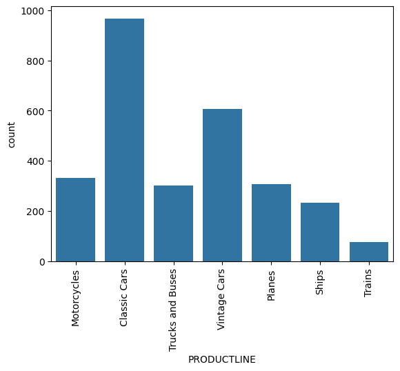
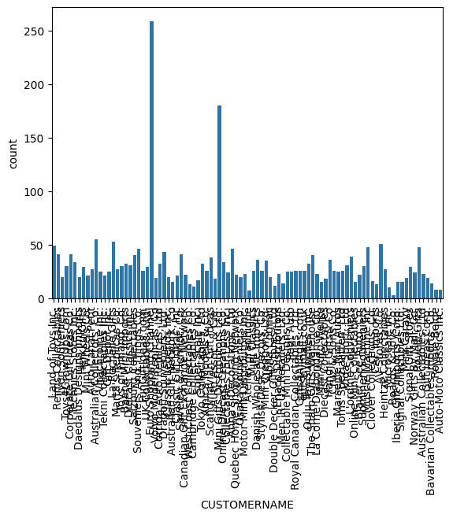
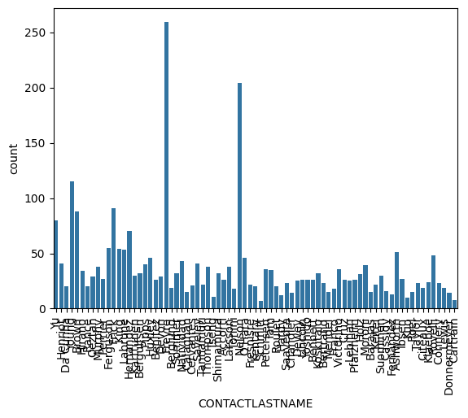
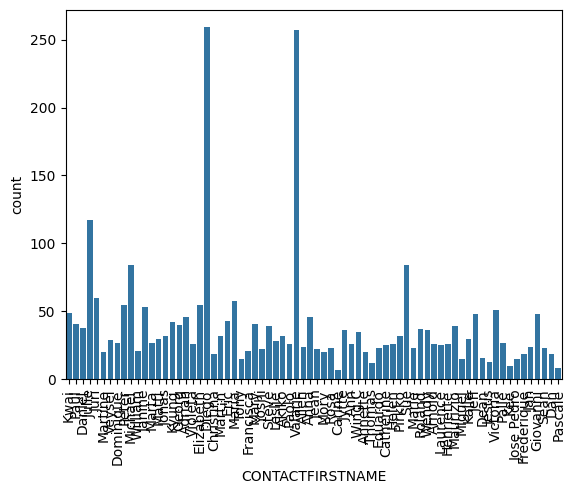
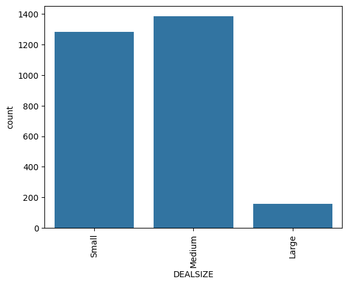

```python
import pandas as pd
import numpy as np
import matplotlib.pyplot as plt
import seaborn as sns
data = pd.read_csv("sales_data_sample.csv", encoding='Latin-1')
data.head()

```


<div>
<style scoped>
    .dataframe tbody tr th:only-of-type {
        vertical-align: middle;
    }

    .dataframe tbody tr th {
        vertical-align: top;
    }

    .dataframe thead th {
        text-align: right;
    }
</style>
<table border="1" class="dataframe">
  <thead>
    <tr style="text-align: right;">
      <th></th>
      <th>ORDERNUMBER</th>
      <th>QUANTITYORDERED</th>
      <th>PRICEEACH</th>
      <th>ORDERLINENUMBER</th>
      <th>SALES</th>
      <th>ORDERDATE</th>
      <th>STATUS</th>
      <th>QTR_ID</th>
      <th>MONTH_ID</th>
      <th>YEAR_ID</th>
      <th>...</th>
      <th>ADDRESSLINE1</th>
      <th>ADDRESSLINE2</th>
      <th>CITY</th>
      <th>STATE</th>
      <th>POSTALCODE</th>
      <th>COUNTRY</th>
      <th>TERRITORY</th>
      <th>CONTACTLASTNAME</th>
      <th>CONTACTFIRSTNAME</th>
      <th>DEALSIZE</th>
    </tr>
  </thead>
  <tbody>
    <tr>
      <th>0</th>
      <td>10107</td>
      <td>30</td>
      <td>95.70</td>
      <td>2</td>
      <td>2871.00</td>
      <td>2/24/2003 0:00</td>
      <td>Shipped</td>
      <td>1</td>
      <td>2</td>
      <td>2003</td>
      <td>...</td>
      <td>897 Long Airport Avenue</td>
      <td>NaN</td>
      <td>NYC</td>
      <td>NY</td>
      <td>10022</td>
      <td>USA</td>
      <td>NaN</td>
      <td>Yu</td>
      <td>Kwai</td>
      <td>Small</td>
    </tr>
    <tr>
      <th>1</th>
      <td>10121</td>
      <td>34</td>
      <td>81.35</td>
      <td>5</td>
      <td>2765.90</td>
      <td>5/7/2003 0:00</td>
      <td>Shipped</td>
      <td>2</td>
      <td>5</td>
      <td>2003</td>
      <td>...</td>
      <td>59 rue de l'Abbaye</td>
      <td>NaN</td>
      <td>Reims</td>
      <td>NaN</td>
      <td>51100</td>
      <td>France</td>
      <td>EMEA</td>
      <td>Henriot</td>
      <td>Paul</td>
      <td>Small</td>
    </tr>
    <tr>
      <th>2</th>
      <td>10134</td>
      <td>41</td>
      <td>94.74</td>
      <td>2</td>
      <td>3884.34</td>
      <td>7/1/2003 0:00</td>
      <td>Shipped</td>
      <td>3</td>
      <td>7</td>
      <td>2003</td>
      <td>...</td>
      <td>27 rue du Colonel Pierre Avia</td>
      <td>NaN</td>
      <td>Paris</td>
      <td>NaN</td>
      <td>75508</td>
      <td>France</td>
      <td>EMEA</td>
      <td>Da Cunha</td>
      <td>Daniel</td>
      <td>Medium</td>
    </tr>
    <tr>
      <th>3</th>
      <td>10145</td>
      <td>45</td>
      <td>83.26</td>
      <td>6</td>
      <td>3746.70</td>
      <td>8/25/2003 0:00</td>
      <td>Shipped</td>
      <td>3</td>
      <td>8</td>
      <td>2003</td>
      <td>...</td>
      <td>78934 Hillside Dr.</td>
      <td>NaN</td>
      <td>Pasadena</td>
      <td>CA</td>
      <td>90003</td>
      <td>USA</td>
      <td>NaN</td>
      <td>Young</td>
      <td>Julie</td>
      <td>Medium</td>
    </tr>
    <tr>
      <th>4</th>
      <td>10159</td>
      <td>49</td>
      <td>100.00</td>
      <td>14</td>
      <td>5205.27</td>
      <td>10/10/2003 0:00</td>
      <td>Shipped</td>
      <td>4</td>
      <td>10</td>
      <td>2003</td>
      <td>...</td>
      <td>7734 Strong St.</td>
      <td>NaN</td>
      <td>San Francisco</td>
      <td>CA</td>
      <td>NaN</td>
      <td>USA</td>
      <td>NaN</td>
      <td>Brown</td>
      <td>Julie</td>
      <td>Medium</td>
    </tr>
  </tbody>
</table>
<p>5 rows × 25 columns</p>
</div>


```python
data.shapedata = pd.read_csv("sales_data_sample.csv", encoding='Latin-1')
print(data.head())
print(data.shape)
print(data.isnull().sum())

```

       ORDERNUMBER  QUANTITYORDERED  PRICEEACH  ORDERLINENUMBER    SALES  \
    0        10107               30      95.70                2  2871.00   
    1        10121               34      81.35                5  2765.90   
    2        10134               41      94.74                2  3884.34   
    3        10145               45      83.26                6  3746.70   
    4        10159               49     100.00               14  5205.27   
    
             ORDERDATE   STATUS  QTR_ID  MONTH_ID  YEAR_ID  ...  \
    0   2/24/2003 0:00  Shipped       1         2     2003  ...   
    1    5/7/2003 0:00  Shipped       2         5     2003  ...   
    2    7/1/2003 0:00  Shipped       3         7     2003  ...   
    3   8/25/2003 0:00  Shipped       3         8     2003  ...   
    4  10/10/2003 0:00  Shipped       4        10     2003  ...   
    
                        ADDRESSLINE1  ADDRESSLINE2           CITY STATE  \
    0        897 Long Airport Avenue           NaN            NYC    NY   
    1             59 rue de l'Abbaye           NaN          Reims   NaN   
    2  27 rue du Colonel Pierre Avia           NaN          Paris   NaN   
    3             78934 Hillside Dr.           NaN       Pasadena    CA   
    4                7734 Strong St.           NaN  San Francisco    CA   
    
      POSTALCODE COUNTRY TERRITORY CONTACTLASTNAME CONTACTFIRSTNAME DEALSIZE  
    0      10022     USA       NaN              Yu             Kwai    Small  
    1      51100  France      EMEA         Henriot             Paul    Small  
    2      75508  France      EMEA        Da Cunha           Daniel   Medium  
    3      90003     USA       NaN           Young            Julie   Medium  
    4        NaN     USA       NaN           Brown            Julie   Medium  
    
    [5 rows x 25 columns]
    (2823, 25)
    ORDERNUMBER            0
    QUANTITYORDERED        0
    PRICEEACH              0
    ORDERLINENUMBER        0
    SALES                  0
    ORDERDATE              0
    STATUS                 0
    QTR_ID                 0
    MONTH_ID               0
    YEAR_ID                0
    PRODUCTLINE            0
    MSRP                   0
    PRODUCTCODE            0
    CUSTOMERNAME           0
    PHONE                  0
    ADDRESSLINE1           0
    ADDRESSLINE2        2521
    CITY                   0
    STATE               1486
    POSTALCODE            76
    COUNTRY                0
    TERRITORY           1074
    CONTACTLASTNAME        0
    CONTACTFIRSTNAME       0
    DEALSIZE               0
    dtype: int64
    

    C:\Users\Shriharsh\AppData\Local\Temp\ipykernel_11744\1637654678.py:1: UserWarning: Pandas doesn't allow columns to be created via a new attribute name - see https://pandas.pydata.org/pandas-docs/stable/indexing.html#attribute-access
      data.shapedata = pd.read_csv("sales_data_sample.csv", encoding='Latin-1')
    


```python
# Number of NAN values per column in the dataset
data.isnull().sum()

```


    ORDERNUMBER            0
    QUANTITYORDERED        0
    PRICEEACH              0
    ORDERLINENUMBER        0
    SALES                  0
    ORDERDATE              0
    STATUS                 0
    QTR_ID                 0
    MONTH_ID               0
    YEAR_ID                0
    PRODUCTLINE            0
    MSRP                   0
    PRODUCTCODE            0
    CUSTOMERNAME           0
    PHONE                  0
    ADDRESSLINE1           0
    ADDRESSLINE2        2521
    CITY                   0
    STATE               1486
    POSTALCODE            76
    COUNTRY                0
    TERRITORY           1074
    CONTACTLASTNAME        0
    CONTACTFIRSTNAME       0
    DEALSIZE               0
    dtype: int64


```python
# Assuming 'data' is a pandas DataFrame, and you're trying to drop the listed columns
data = data.drop(["ORDERNUMBER", "PRICEEACH", "ORDERDATE", "PHONE", 
                  "ADDRESSLINE1", "ADDRESSLINE2", "CITY", "STATE", 
                  "TERRITORY", "POSTALCODE", "COUNTRY"], axis=1)

# Display the first few rows of the modified dataframe
data.head()

```


<div>
<style scoped>
    .dataframe tbody tr th:only-of-type {
        vertical-align: middle;
    }

    .dataframe tbody tr th {
        vertical-align: top;
    }

    .dataframe thead th {
        text-align: right;
    }
</style>
<table border="1" class="dataframe">
  <thead>
    <tr style="text-align: right;">
      <th></th>
      <th>QUANTITYORDERED</th>
      <th>ORDERLINENUMBER</th>
      <th>SALES</th>
      <th>STATUS</th>
      <th>QTR_ID</th>
      <th>MONTH_ID</th>
      <th>YEAR_ID</th>
      <th>PRODUCTLINE</th>
      <th>MSRP</th>
      <th>PRODUCTCODE</th>
      <th>CUSTOMERNAME</th>
      <th>CONTACTLASTNAME</th>
      <th>CONTACTFIRSTNAME</th>
      <th>DEALSIZE</th>
    </tr>
  </thead>
  <tbody>
    <tr>
      <th>0</th>
      <td>30</td>
      <td>2</td>
      <td>2871.00</td>
      <td>Shipped</td>
      <td>1</td>
      <td>2</td>
      <td>2003</td>
      <td>Motorcycles</td>
      <td>95</td>
      <td>S10_1678</td>
      <td>Land of Toys Inc.</td>
      <td>Yu</td>
      <td>Kwai</td>
      <td>Small</td>
    </tr>
    <tr>
      <th>1</th>
      <td>34</td>
      <td>5</td>
      <td>2765.90</td>
      <td>Shipped</td>
      <td>2</td>
      <td>5</td>
      <td>2003</td>
      <td>Motorcycles</td>
      <td>95</td>
      <td>S10_1678</td>
      <td>Reims Collectables</td>
      <td>Henriot</td>
      <td>Paul</td>
      <td>Small</td>
    </tr>
    <tr>
      <th>2</th>
      <td>41</td>
      <td>2</td>
      <td>3884.34</td>
      <td>Shipped</td>
      <td>3</td>
      <td>7</td>
      <td>2003</td>
      <td>Motorcycles</td>
      <td>95</td>
      <td>S10_1678</td>
      <td>Lyon Souveniers</td>
      <td>Da Cunha</td>
      <td>Daniel</td>
      <td>Medium</td>
    </tr>
    <tr>
      <th>3</th>
      <td>45</td>
      <td>6</td>
      <td>3746.70</td>
      <td>Shipped</td>
      <td>3</td>
      <td>8</td>
      <td>2003</td>
      <td>Motorcycles</td>
      <td>95</td>
      <td>S10_1678</td>
      <td>Toys4GrownUps.com</td>
      <td>Young</td>
      <td>Julie</td>
      <td>Medium</td>
    </tr>
    <tr>
      <th>4</th>
      <td>49</td>
      <td>14</td>
      <td>5205.27</td>
      <td>Shipped</td>
      <td>4</td>
      <td>10</td>
      <td>2003</td>
      <td>Motorcycles</td>
      <td>95</td>
      <td>S10_1678</td>
      <td>Corporate Gift Ideas Co.</td>
      <td>Brown</td>
      <td>Julie</td>
      <td>Medium</td>
    </tr>
  </tbody>
</table>
</div>


```python
data.isnull().sum()
```


    QUANTITYORDERED     0
    ORDERLINENUMBER     0
    SALES               0
    STATUS              0
    QTR_ID              0
    MONTH_ID            0
    YEAR_ID             0
    PRODUCTLINE         0
    MSRP                0
    PRODUCTCODE         0
    CUSTOMERNAME        0
    CONTACTLASTNAME     0
    CONTACTFIRSTNAME    0
    DEALSIZE            0
    dtype: int64


```python
data.describe()
```


<div>
<style scoped>
    .dataframe tbody tr th:only-of-type {
        vertical-align: middle;
    }

    .dataframe tbody tr th {
        vertical-align: top;
    }

    .dataframe thead th {
        text-align: right;
    }
</style>
<table border="1" class="dataframe">
  <thead>
    <tr style="text-align: right;">
      <th></th>
      <th>QUANTITYORDERED</th>
      <th>ORDERLINENUMBER</th>
      <th>SALES</th>
      <th>QTR_ID</th>
      <th>MONTH_ID</th>
      <th>YEAR_ID</th>
      <th>MSRP</th>
    </tr>
  </thead>
  <tbody>
    <tr>
      <th>count</th>
      <td>2823.000000</td>
      <td>2823.000000</td>
      <td>2823.000000</td>
      <td>2823.000000</td>
      <td>2823.000000</td>
      <td>2823.00000</td>
      <td>2823.000000</td>
    </tr>
    <tr>
      <th>mean</th>
      <td>35.092809</td>
      <td>6.466171</td>
      <td>3553.889072</td>
      <td>2.717676</td>
      <td>7.092455</td>
      <td>2003.81509</td>
      <td>100.715551</td>
    </tr>
    <tr>
      <th>std</th>
      <td>9.741443</td>
      <td>4.225841</td>
      <td>1841.865106</td>
      <td>1.203878</td>
      <td>3.656633</td>
      <td>0.69967</td>
      <td>40.187912</td>
    </tr>
    <tr>
      <th>min</th>
      <td>6.000000</td>
      <td>1.000000</td>
      <td>482.130000</td>
      <td>1.000000</td>
      <td>1.000000</td>
      <td>2003.00000</td>
      <td>33.000000</td>
    </tr>
    <tr>
      <th>25%</th>
      <td>27.000000</td>
      <td>3.000000</td>
      <td>2203.430000</td>
      <td>2.000000</td>
      <td>4.000000</td>
      <td>2003.00000</td>
      <td>68.000000</td>
    </tr>
    <tr>
      <th>50%</th>
      <td>35.000000</td>
      <td>6.000000</td>
      <td>3184.800000</td>
      <td>3.000000</td>
      <td>8.000000</td>
      <td>2004.00000</td>
      <td>99.000000</td>
    </tr>
    <tr>
      <th>75%</th>
      <td>43.000000</td>
      <td>9.000000</td>
      <td>4508.000000</td>
      <td>4.000000</td>
      <td>11.000000</td>
      <td>2004.00000</td>
      <td>124.000000</td>
    </tr>
    <tr>
      <th>max</th>
      <td>97.000000</td>
      <td>18.000000</td>
      <td>14082.800000</td>
      <td>4.000000</td>
      <td>12.000000</td>
      <td>2005.00000</td>
      <td>214.000000</td>
    </tr>
  </tbody>
</table>
</div>


```python
sns.countplot(data = data , x = 'STATUS')

```


    <Axes: xlabel='STATUS', ylabel='count'>


    

    


```python
import seaborn as sns
sns.histplot(x = 'SALES' , hue = 'PRODUCTLINE', data = data,
element="poly")
```


    <Axes: xlabel='SALES', ylabel='Count'>


    

    


```python
#Here we can see all the catagory lies in the range of price and hence in this we be creating a cluster on targeting the same
data['PRODUCTLINE'].unique()
```


    array(['Motorcycles', 'Classic Cars', 'Trucks and Buses', 'Vintage Cars',
           'Planes', 'Ships', 'Trains'], dtype=object)


```python
#checking the duplicated values
data.drop_duplicates(inplace=True)
```


```python
data.info()
```

    <class 'pandas.core.frame.DataFrame'>
    RangeIndex: 2823 entries, 0 to 2822
    Data columns (total 14 columns):
     #   Column            Non-Null Count  Dtype  
    ---  ------            --------------  -----  
     0   QUANTITYORDERED   2823 non-null   int64  
     1   ORDERLINENUMBER   2823 non-null   int64  
     2   SALES             2823 non-null   float64
     3   STATUS            2823 non-null   object 
     4   QTR_ID            2823 non-null   int64  
     5   MONTH_ID          2823 non-null   int64  
     6   YEAR_ID           2823 non-null   int64  
     7   PRODUCTLINE       2823 non-null   object 
     8   MSRP              2823 non-null   int64  
     9   PRODUCTCODE       2823 non-null   object 
     10  CUSTOMERNAME      2823 non-null   object 
     11  CONTACTLASTNAME   2823 non-null   object 
     12  CONTACTFIRSTNAME  2823 non-null   object 
     13  DEALSIZE          2823 non-null   object 
    dtypes: float64(1), int64(6), object(7)
    memory usage: 308.9+ KB
    


```python
list_cat = data.select_dtypes(include=['object']).columns.tolist()
list_cat
```


    ['STATUS',
     'PRODUCTLINE',
     'PRODUCTCODE',
     'CUSTOMERNAME',
     'CONTACTLASTNAME',
     'CONTACTFIRSTNAME',
     'DEALSIZE']


```python
for i in list_cat:
    sns.countplot(data = data ,x = i)
    plt.xticks(rotation = 90)
    plt.show()

```


    

    


    

    


    

    


    

    


    

    


    

    


    

    


```python
#dealing with the catagorical features
from sklearn import preprocessing
le = preprocessing.LabelEncoder()
# Encode labels in column 'species'.
for i in list_cat:
    data[i]= le.fit_transform(data[i])

```


```python
data.info()

```

    <class 'pandas.core.frame.DataFrame'>
    RangeIndex: 2823 entries, 0 to 2822
    Data columns (total 14 columns):
     #   Column            Non-Null Count  Dtype  
    ---  ------            --------------  -----  
     0   QUANTITYORDERED   2823 non-null   int64  
     1   ORDERLINENUMBER   2823 non-null   int64  
     2   SALES             2823 non-null   float64
     3   STATUS            2823 non-null   int32  
     4   QTR_ID            2823 non-null   int64  
     5   MONTH_ID          2823 non-null   int64  
     6   YEAR_ID           2823 non-null   int64  
     7   PRODUCTLINE       2823 non-null   int32  
     8   MSRP              2823 non-null   int64  
     9   PRODUCTCODE       2823 non-null   int32  
     10  CUSTOMERNAME      2823 non-null   int32  
     11  CONTACTLASTNAME   2823 non-null   int32  
     12  CONTACTFIRSTNAME  2823 non-null   int32  
     13  DEALSIZE          2823 non-null   int32  
    dtypes: float64(1), int32(7), int64(6)
    memory usage: 231.7 KB
    


```python
data['SALES'] = data['SALES'].astype(int)
data.info()

```

    <class 'pandas.core.frame.DataFrame'>
    RangeIndex: 2823 entries, 0 to 2822
    Data columns (total 14 columns):
     #   Column            Non-Null Count  Dtype
    ---  ------            --------------  -----
     0   QUANTITYORDERED   2823 non-null   int64
     1   ORDERLINENUMBER   2823 non-null   int64
     2   SALES             2823 non-null   int32
     3   STATUS            2823 non-null   int32
     4   QTR_ID            2823 non-null   int64
     5   MONTH_ID          2823 non-null   int64
     6   YEAR_ID           2823 non-null   int64
     7   PRODUCTLINE       2823 non-null   int32
     8   MSRP              2823 non-null   int64
     9   PRODUCTCODE       2823 non-null   int32
     10  CUSTOMERNAME      2823 non-null   int32
     11  CONTACTLASTNAME   2823 non-null   int32
     12  CONTACTFIRSTNAME  2823 non-null   int32
     13  DEALSIZE          2823 non-null   int32
    dtypes: int32(8), int64(6)
    memory usage: 220.7 KB
    


```python
data.describe()
```


<div>
<style scoped>
    .dataframe tbody tr th:only-of-type {
        vertical-align: middle;
    }

    .dataframe tbody tr th {
        vertical-align: top;
    }

    .dataframe thead th {
        text-align: right;
    }
</style>
<table border="1" class="dataframe">
  <thead>
    <tr style="text-align: right;">
      <th></th>
      <th>QUANTITYORDERED</th>
      <th>ORDERLINENUMBER</th>
      <th>SALES</th>
      <th>STATUS</th>
      <th>QTR_ID</th>
      <th>MONTH_ID</th>
      <th>YEAR_ID</th>
      <th>PRODUCTLINE</th>
      <th>MSRP</th>
      <th>PRODUCTCODE</th>
      <th>CUSTOMERNAME</th>
      <th>CONTACTLASTNAME</th>
      <th>CONTACTFIRSTNAME</th>
      <th>DEALSIZE</th>
    </tr>
  </thead>
  <tbody>
    <tr>
      <th>count</th>
      <td>2823.000000</td>
      <td>2823.000000</td>
      <td>2823.000000</td>
      <td>2823.000000</td>
      <td>2823.000000</td>
      <td>2823.000000</td>
      <td>2823.00000</td>
      <td>2823.000000</td>
      <td>2823.000000</td>
      <td>2823.000000</td>
      <td>2823.000000</td>
      <td>2823.000000</td>
      <td>2823.000000</td>
      <td>2823.000000</td>
    </tr>
    <tr>
      <th>mean</th>
      <td>35.092809</td>
      <td>6.466171</td>
      <td>3553.421537</td>
      <td>4.782501</td>
      <td>2.717676</td>
      <td>7.092455</td>
      <td>2003.81509</td>
      <td>2.515055</td>
      <td>100.715551</td>
      <td>53.773291</td>
      <td>46.212186</td>
      <td>39.462983</td>
      <td>36.552958</td>
      <td>1.398512</td>
    </tr>
    <tr>
      <th>std</th>
      <td>9.741443</td>
      <td>4.225841</td>
      <td>1841.865754</td>
      <td>0.879416</td>
      <td>1.203878</td>
      <td>3.656633</td>
      <td>0.69967</td>
      <td>2.411665</td>
      <td>40.187912</td>
      <td>31.585298</td>
      <td>24.936147</td>
      <td>21.511060</td>
      <td>21.018468</td>
      <td>0.592498</td>
    </tr>
    <tr>
      <th>min</th>
      <td>6.000000</td>
      <td>1.000000</td>
      <td>482.000000</td>
      <td>0.000000</td>
      <td>1.000000</td>
      <td>1.000000</td>
      <td>2003.00000</td>
      <td>0.000000</td>
      <td>33.000000</td>
      <td>0.000000</td>
      <td>0.000000</td>
      <td>0.000000</td>
      <td>0.000000</td>
      <td>0.000000</td>
    </tr>
    <tr>
      <th>25%</th>
      <td>27.000000</td>
      <td>3.000000</td>
      <td>2203.000000</td>
      <td>5.000000</td>
      <td>2.000000</td>
      <td>4.000000</td>
      <td>2003.00000</td>
      <td>0.000000</td>
      <td>68.000000</td>
      <td>27.000000</td>
      <td>29.000000</td>
      <td>25.000000</td>
      <td>16.000000</td>
      <td>1.000000</td>
    </tr>
    <tr>
      <th>50%</th>
      <td>35.000000</td>
      <td>6.000000</td>
      <td>3184.000000</td>
      <td>5.000000</td>
      <td>3.000000</td>
      <td>8.000000</td>
      <td>2004.00000</td>
      <td>2.000000</td>
      <td>99.000000</td>
      <td>53.000000</td>
      <td>45.000000</td>
      <td>39.000000</td>
      <td>36.000000</td>
      <td>1.000000</td>
    </tr>
    <tr>
      <th>75%</th>
      <td>43.000000</td>
      <td>9.000000</td>
      <td>4508.000000</td>
      <td>5.000000</td>
      <td>4.000000</td>
      <td>11.000000</td>
      <td>2004.00000</td>
      <td>5.000000</td>
      <td>124.000000</td>
      <td>81.000000</td>
      <td>67.000000</td>
      <td>56.000000</td>
      <td>57.000000</td>
      <td>2.000000</td>
    </tr>
    <tr>
      <th>max</th>
      <td>97.000000</td>
      <td>18.000000</td>
      <td>14082.000000</td>
      <td>5.000000</td>
      <td>4.000000</td>
      <td>12.000000</td>
      <td>2005.00000</td>
      <td>6.000000</td>
      <td>214.000000</td>
      <td>108.000000</td>
      <td>91.000000</td>
      <td>76.000000</td>
      <td>71.000000</td>
      <td>2.000000</td>
    </tr>
  </tbody>
</table>
</div>


```python
## taget feature are Sales and productline
X = data[['SALES','PRODUCTCODE']]

```


```python
data.columns

```


    Index(['QUANTITYORDERED', 'ORDERLINENUMBER', 'SALES', 'STATUS', 'QTR_ID',
           'MONTH_ID', 'YEAR_ID', 'PRODUCTLINE', 'MSRP', 'PRODUCTCODE',
           'CUSTOMERNAME', 'CONTACTLASTNAME', 'CONTACTFIRSTNAME', 'DEALSIZE'],
          dtype='object')


```python
from yellowbrick.cluster import KElbowVisualizer
model = KMeans()
visualizer = KElbowVisualizer(model, k=(1,12)).fit(X)
visualizer.show()
```


```python
from sklearn.cluster import KMeans
kmeans = KMeans(n_clusters=4, init='k-means++', random_state=0).fit(X)
kmeans.labels_
```


```python
kmeans.inertia_
```


```python
kmeans.n_iter_
```


```python
kmeans.cluster_centers_
```


```python
#getting the size of the clusters
from collections import Counter
Counter(kmeans.labels_)

```


```python
#Hence the NUmber of Clusters to be choosen Will be 4 according to the elbow method
sns.scatterplot(data=X, x="SALES", y="PRODUCTCODE", hue=kmeans.labels_)
plt.scatter(kmeans.cluster_centers_[:,0], kmeans.cluster_centers_[:,1],
marker="X", c="r", s=80, label="centroids")
plt.legend()
plt.show()

```
