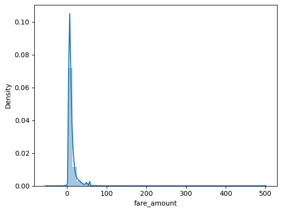
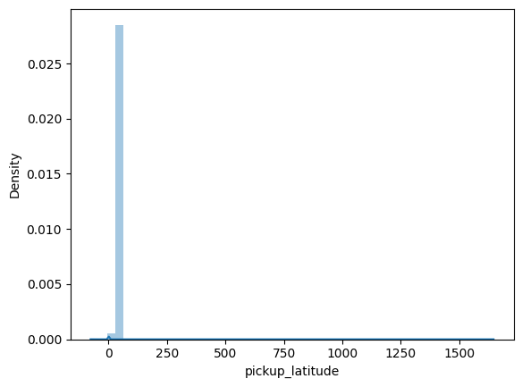
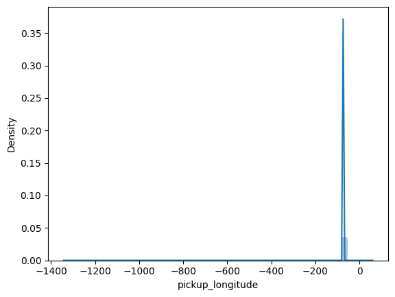
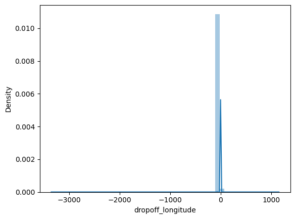
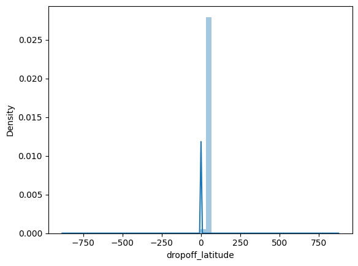

```python
import pandas as pd
import numpy as np
import seaborn as sns
import matplotlib.pyplot as plt
%matplotlib inline
from scipy.stats import chi2_contingency
import seaborn as sns
from sklearn.neighbors import KNeighborsClassifier
from random import randrange, uniform

```


```python
Train_Data = pd.read_csv(r'ubertrain.csv')
```


```python
Train_Data.head()

```


<div>
<style scoped>
    .dataframe tbody tr th:only-of-type {
        vertical-align: middle;
    }

    .dataframe tbody tr th {
        vertical-align: top;
    }

    .dataframe thead th {
        text-align: right;
    }
</style>
<table border="1" class="dataframe">
  <thead>
    <tr style="text-align: right;">
      <th></th>
      <th>Unnamed: 0</th>
      <th>key</th>
      <th>fare_amount</th>
      <th>pickup_datetime</th>
      <th>pickup_longitude</th>
      <th>pickup_latitude</th>
      <th>dropoff_longitude</th>
      <th>dropoff_latitude</th>
      <th>passenger_count</th>
    </tr>
  </thead>
  <tbody>
    <tr>
      <th>0</th>
      <td>24238194</td>
      <td>2015-05-07 19:52:06.0000003</td>
      <td>7.5</td>
      <td>2015-05-07 19:52:06 UTC</td>
      <td>-73.999817</td>
      <td>40.738354</td>
      <td>-73.999512</td>
      <td>40.723217</td>
      <td>1</td>
    </tr>
    <tr>
      <th>1</th>
      <td>27835199</td>
      <td>2009-07-17 20:04:56.0000002</td>
      <td>7.7</td>
      <td>2009-07-17 20:04:56 UTC</td>
      <td>-73.994355</td>
      <td>40.728225</td>
      <td>-73.994710</td>
      <td>40.750325</td>
      <td>1</td>
    </tr>
    <tr>
      <th>2</th>
      <td>44984355</td>
      <td>2009-08-24 21:45:00.00000061</td>
      <td>12.9</td>
      <td>2009-08-24 21:45:00 UTC</td>
      <td>-74.005043</td>
      <td>40.740770</td>
      <td>-73.962565</td>
      <td>40.772647</td>
      <td>1</td>
    </tr>
    <tr>
      <th>3</th>
      <td>25894730</td>
      <td>2009-06-26 08:22:21.0000001</td>
      <td>5.3</td>
      <td>2009-06-26 08:22:21 UTC</td>
      <td>-73.976124</td>
      <td>40.790844</td>
      <td>-73.965316</td>
      <td>40.803349</td>
      <td>3</td>
    </tr>
    <tr>
      <th>4</th>
      <td>17610152</td>
      <td>2014-08-28 17:47:00.000000188</td>
      <td>16.0</td>
      <td>2014-08-28 17:47:00 UTC</td>
      <td>-73.925023</td>
      <td>40.744085</td>
      <td>-73.973082</td>
      <td>40.761247</td>
      <td>5</td>
    </tr>
  </tbody>
</table>
</div>


```python
Train_Data.drop(labels='Unnamed: 0',axis=1,inplace=True)
Train_Data.drop(labels='key',axis=1,inplace=True)
Train_Data.shape
```


    (200000, 7)


```python
test = pd.read_csv(r'ubertest.csv')
```

    C:\Users\Shriharsh\AppData\Local\Temp\ipykernel_3504\3785889295.py:1: DtypeWarning: Columns (1,3) have mixed types. Specify dtype option on import or set low_memory=False.
      test = pd.read_csv(r'ubertest.csv')
    


```python
test.head(3)

```


<div>
<style scoped>
    .dataframe tbody tr th:only-of-type {
        vertical-align: middle;
    }

    .dataframe tbody tr th {
        vertical-align: top;
    }

    .dataframe thead th {
        text-align: right;
    }
</style>
<table border="1" class="dataframe">
  <thead>
    <tr style="text-align: right;">
      <th></th>
      <th>Unnamed: 0</th>
      <th>key</th>
      <th>fare_amount</th>
      <th>pickup_datetime</th>
      <th>pickup_longitude</th>
      <th>pickup_latitude</th>
      <th>dropoff_longitude</th>
      <th>dropoff_latitude</th>
      <th>passenger_count</th>
    </tr>
  </thead>
  <tbody>
    <tr>
      <th>0</th>
      <td>24238194.0</td>
      <td>52:06.0</td>
      <td>7.5</td>
      <td>2015-05-07 19:52:06 UTC</td>
      <td>-73.999817</td>
      <td>40.738354</td>
      <td>-73.999512</td>
      <td>40.723217</td>
      <td>1.0</td>
    </tr>
    <tr>
      <th>1</th>
      <td>27835199.0</td>
      <td>04:56.0</td>
      <td>7.7</td>
      <td>2009-07-17 20:04:56 UTC</td>
      <td>-73.994355</td>
      <td>40.728225</td>
      <td>-73.994710</td>
      <td>40.750325</td>
      <td>1.0</td>
    </tr>
    <tr>
      <th>2</th>
      <td>44984355.0</td>
      <td>45:00.0</td>
      <td>12.9</td>
      <td>2009-08-24 21:45:00 UTC</td>
      <td>-74.005043</td>
      <td>40.740770</td>
      <td>-73.962565</td>
      <td>40.772647</td>
      <td>1.0</td>
    </tr>
  </tbody>
</table>
</div>


```python
test.shape,Train_Data.shape
```


    ((200000, 9), (200000, 7))


```python
Train_Data.head()

```


<div>
<style scoped>
    .dataframe tbody tr th:only-of-type {
        vertical-align: middle;
    }

    .dataframe tbody tr th {
        vertical-align: top;
    }

    .dataframe thead th {
        text-align: right;
    }
</style>
<table border="1" class="dataframe">
  <thead>
    <tr style="text-align: right;">
      <th></th>
      <th>fare_amount</th>
      <th>pickup_datetime</th>
      <th>pickup_longitude</th>
      <th>pickup_latitude</th>
      <th>dropoff_longitude</th>
      <th>dropoff_latitude</th>
      <th>passenger_count</th>
    </tr>
  </thead>
  <tbody>
    <tr>
      <th>0</th>
      <td>7.5</td>
      <td>2015-05-07 19:52:06 UTC</td>
      <td>-73.999817</td>
      <td>40.738354</td>
      <td>-73.999512</td>
      <td>40.723217</td>
      <td>1</td>
    </tr>
    <tr>
      <th>1</th>
      <td>7.7</td>
      <td>2009-07-17 20:04:56 UTC</td>
      <td>-73.994355</td>
      <td>40.728225</td>
      <td>-73.994710</td>
      <td>40.750325</td>
      <td>1</td>
    </tr>
    <tr>
      <th>2</th>
      <td>12.9</td>
      <td>2009-08-24 21:45:00 UTC</td>
      <td>-74.005043</td>
      <td>40.740770</td>
      <td>-73.962565</td>
      <td>40.772647</td>
      <td>1</td>
    </tr>
    <tr>
      <th>3</th>
      <td>5.3</td>
      <td>2009-06-26 08:22:21 UTC</td>
      <td>-73.976124</td>
      <td>40.790844</td>
      <td>-73.965316</td>
      <td>40.803349</td>
      <td>3</td>
    </tr>
    <tr>
      <th>4</th>
      <td>16.0</td>
      <td>2014-08-28 17:47:00 UTC</td>
      <td>-73.925023</td>
      <td>40.744085</td>
      <td>-73.973082</td>
      <td>40.761247</td>
      <td>5</td>
    </tr>
  </tbody>
</table>
</div>


```python
test.head()

```


<div>
<style scoped>
    .dataframe tbody tr th:only-of-type {
        vertical-align: middle;
    }

    .dataframe tbody tr th {
        vertical-align: top;
    }

    .dataframe thead th {
        text-align: right;
    }
</style>
<table border="1" class="dataframe">
  <thead>
    <tr style="text-align: right;">
      <th></th>
      <th>Unnamed: 0</th>
      <th>key</th>
      <th>fare_amount</th>
      <th>pickup_datetime</th>
      <th>pickup_longitude</th>
      <th>pickup_latitude</th>
      <th>dropoff_longitude</th>
      <th>dropoff_latitude</th>
      <th>passenger_count</th>
    </tr>
  </thead>
  <tbody>
    <tr>
      <th>0</th>
      <td>24238194.0</td>
      <td>52:06.0</td>
      <td>7.5</td>
      <td>2015-05-07 19:52:06 UTC</td>
      <td>-73.999817</td>
      <td>40.738354</td>
      <td>-73.999512</td>
      <td>40.723217</td>
      <td>1.0</td>
    </tr>
    <tr>
      <th>1</th>
      <td>27835199.0</td>
      <td>04:56.0</td>
      <td>7.7</td>
      <td>2009-07-17 20:04:56 UTC</td>
      <td>-73.994355</td>
      <td>40.728225</td>
      <td>-73.994710</td>
      <td>40.750325</td>
      <td>1.0</td>
    </tr>
    <tr>
      <th>2</th>
      <td>44984355.0</td>
      <td>45:00.0</td>
      <td>12.9</td>
      <td>2009-08-24 21:45:00 UTC</td>
      <td>-74.005043</td>
      <td>40.740770</td>
      <td>-73.962565</td>
      <td>40.772647</td>
      <td>1.0</td>
    </tr>
    <tr>
      <th>3</th>
      <td>25894730.0</td>
      <td>22:21.0</td>
      <td>5.3</td>
      <td>2009-06-26 08:22:21 UTC</td>
      <td>-73.976124</td>
      <td>40.790844</td>
      <td>-73.965316</td>
      <td>40.803349</td>
      <td>3.0</td>
    </tr>
    <tr>
      <th>4</th>
      <td>17610152.0</td>
      <td>47:00.0</td>
      <td>16.0</td>
      <td>2014-08-28 17:47:00 UTC</td>
      <td>-73.925023</td>
      <td>40.744085</td>
      <td>-73.973082</td>
      <td>40.761247</td>
      <td>5.0</td>
    </tr>
  </tbody>
</table>
</div>


```python
As this is Taxi fare data and we know there are many factors which affect the price of
taxi like

1. Travelled distance
2. Time of Travel
3. Demand and Availability of Taxi
4. Some special places are more costlier like Airport or other places where there might be toll


```


      Cell In[10], line 1
        As this is Taxi fare data and we know there are many factors which affect the price of
           ^
    SyntaxError: invalid syntax
    


```python
print(Train_Data.info())
print(test.info())

```

    <class 'pandas.core.frame.DataFrame'>
    RangeIndex: 200000 entries, 0 to 199999
    Data columns (total 7 columns):
     #   Column             Non-Null Count   Dtype  
    ---  ------             --------------   -----  
     0   fare_amount        200000 non-null  float64
     1   pickup_datetime    200000 non-null  object 
     2   pickup_longitude   200000 non-null  float64
     3   pickup_latitude    200000 non-null  float64
     4   dropoff_longitude  199999 non-null  float64
     5   dropoff_latitude   199999 non-null  float64
     6   passenger_count    200000 non-null  int64  
    dtypes: float64(5), int64(1), object(1)
    memory usage: 10.7+ MB
    None
    <class 'pandas.core.frame.DataFrame'>
    RangeIndex: 200000 entries, 0 to 199999
    Data columns (total 9 columns):
     #   Column             Non-Null Count  Dtype  
    ---  ------             --------------  -----  
     0   Unnamed: 0         64083 non-null  float64
     1   key                64083 non-null  object 
     2   fare_amount        64083 non-null  float64
     3   pickup_datetime    64083 non-null  object 
     4   pickup_longitude   64083 non-null  float64
     5   pickup_latitude    64083 non-null  float64
     6   dropoff_longitude  64083 non-null  float64
     7   dropoff_latitude   64083 non-null  float64
     8   passenger_count    64083 non-null  float64
    dtypes: float64(7), object(2)
    memory usage: 13.7+ MB
    None
    


```python
here we can see there are 8columns in which 6 numerics and 2 are object.
Lets change the type of pickup_datetime from object to DateTime
```


      Cell In[55], line 1
        here we can see there are 8columns in which 6 numerics and 2 are object.
                                  ^
    SyntaxError: invalid decimal literal
    


```python
Train_Data["pickup_datetime"] = pd.to_datetime(Train_Data["pickup_datetime"])
print(Train_Data.info())
```

    <class 'pandas.core.frame.DataFrame'>
    RangeIndex: 200000 entries, 0 to 199999
    Data columns (total 7 columns):
     #   Column             Non-Null Count   Dtype              
    ---  ------             --------------   -----              
     0   fare_amount        200000 non-null  float64            
     1   pickup_datetime    200000 non-null  datetime64[ns, UTC]
     2   pickup_longitude   200000 non-null  float64            
     3   pickup_latitude    200000 non-null  float64            
     4   dropoff_longitude  199999 non-null  float64            
     5   dropoff_latitude   199999 non-null  float64            
     6   passenger_count    200000 non-null  int64              
    dtypes: datetime64[ns, UTC](1), float64(5), int64(1)
    memory usage: 10.7 MB
    None
    


```python
Train_Data.describe()

```


<div>
<style scoped>
    .dataframe tbody tr th:only-of-type {
        vertical-align: middle;
    }

    .dataframe tbody tr th {
        vertical-align: top;
    }

    .dataframe thead th {
        text-align: right;
    }
</style>
<table border="1" class="dataframe">
  <thead>
    <tr style="text-align: right;">
      <th></th>
      <th>fare_amount</th>
      <th>pickup_longitude</th>
      <th>pickup_latitude</th>
      <th>dropoff_longitude</th>
      <th>dropoff_latitude</th>
      <th>passenger_count</th>
    </tr>
  </thead>
  <tbody>
    <tr>
      <th>count</th>
      <td>200000.000000</td>
      <td>200000.000000</td>
      <td>200000.000000</td>
      <td>199999.000000</td>
      <td>199999.000000</td>
      <td>200000.000000</td>
    </tr>
    <tr>
      <th>mean</th>
      <td>11.359955</td>
      <td>-72.527638</td>
      <td>39.935885</td>
      <td>-72.525292</td>
      <td>39.923890</td>
      <td>1.684535</td>
    </tr>
    <tr>
      <th>std</th>
      <td>9.901776</td>
      <td>11.437787</td>
      <td>7.720539</td>
      <td>13.117408</td>
      <td>6.794829</td>
      <td>1.385997</td>
    </tr>
    <tr>
      <th>min</th>
      <td>-52.000000</td>
      <td>-1340.648410</td>
      <td>-74.015515</td>
      <td>-3356.666300</td>
      <td>-881.985513</td>
      <td>0.000000</td>
    </tr>
    <tr>
      <th>25%</th>
      <td>6.000000</td>
      <td>-73.992065</td>
      <td>40.734796</td>
      <td>-73.991407</td>
      <td>40.733823</td>
      <td>1.000000</td>
    </tr>
    <tr>
      <th>50%</th>
      <td>8.500000</td>
      <td>-73.981823</td>
      <td>40.752592</td>
      <td>-73.980093</td>
      <td>40.753042</td>
      <td>1.000000</td>
    </tr>
    <tr>
      <th>75%</th>
      <td>12.500000</td>
      <td>-73.967154</td>
      <td>40.767158</td>
      <td>-73.963658</td>
      <td>40.768001</td>
      <td>2.000000</td>
    </tr>
    <tr>
      <th>max</th>
      <td>499.000000</td>
      <td>57.418457</td>
      <td>1644.421482</td>
      <td>1153.572603</td>
      <td>872.697628</td>
      <td>208.000000</td>
    </tr>
  </tbody>
</table>
</div>


```python
1.Here first thing which we can see is minimum value of fare is negative which is -52 which is not the valid value, so we need to remove the fare
which are negative values.
2.Secondly, passenger_count minimum value is 0 and maximum value is 208 which impossible, so we need to remove them as well, for safer
side we can think that a taxi can have maximum 7 people.
Unsupported Cell Type. Double-Click to inspect/edit the content.
```


      Cell In[61], line 1
        1.Here first thing which we can see is minimum value of fare is negative which is -52 which is not the valid value, so we need to remove the fare
         ^
    SyntaxError: invalid decimal literal
    


```python
Train_Data.isnull().sum()
```


    fare_amount          0
    pickup_datetime      0
    pickup_longitude     0
    pickup_latitude      0
    dropoff_longitude    1
    dropoff_latitude     1
    passenger_count      0
    dtype: int64


```python
Train_Data.dropna(axis = 0, inplace= True)
print(Train_Data.isnull().sum())

```

    fare_amount          0
    pickup_datetime      0
    pickup_longitude     0
    pickup_latitude      0
    dropoff_longitude    0
    dropoff_latitude     0
    passenger_count      0
    dtype: int64
    


```python
Lets see the statistics of our data

```


      Cell In[67], line 1
        Lets see the statistics of our data
             ^
    SyntaxError: invalid syntax
    


```python
sns.distplot(Train_Data['fare_amount'])

```

    C:\Users\Shriharsh\AppData\Local\Temp\ipykernel_3504\929965172.py:1: UserWarning: 
    
    `distplot` is a deprecated function and will be removed in seaborn v0.14.0.
    
    Please adapt your code to use either `displot` (a figure-level function with
    similar flexibility) or `histplot` (an axes-level function for histograms).
    
    For a guide to updating your code to use the new functions, please see
    https://gist.github.com/mwaskom/de44147ed2974457ad6372750bbe5751
    
      sns.distplot(Train_Data['fare_amount'])
    


    <Axes: xlabel='fare_amount', ylabel='Density'>


    

    


```python
sns.distplot(Train_Data['pickup_latitude'])

```

    C:\Users\Shriharsh\AppData\Local\Temp\ipykernel_3504\2099128119.py:1: UserWarning: 
    
    `distplot` is a deprecated function and will be removed in seaborn v0.14.0.
    
    Please adapt your code to use either `displot` (a figure-level function with
    similar flexibility) or `histplot` (an axes-level function for histograms).
    
    For a guide to updating your code to use the new functions, please see
    https://gist.github.com/mwaskom/de44147ed2974457ad6372750bbe5751
    
      sns.distplot(Train_Data['pickup_latitude'])
    


    <Axes: xlabel='pickup_latitude', ylabel='Density'>


    

    


```python
sns.distplot(Train_Data['pickup_longitude'])
```

    C:\Users\Shriharsh\AppData\Local\Temp\ipykernel_3504\3969133075.py:1: UserWarning: 
    
    `distplot` is a deprecated function and will be removed in seaborn v0.14.0.
    
    Please adapt your code to use either `displot` (a figure-level function with
    similar flexibility) or `histplot` (an axes-level function for histograms).
    
    For a guide to updating your code to use the new functions, please see
    https://gist.github.com/mwaskom/de44147ed2974457ad6372750bbe5751
    
      sns.distplot(Train_Data['pickup_longitude'])
    


    <Axes: xlabel='pickup_longitude', ylabel='Density'>


    

    


```python
sns.distplot(Train_Data['dropoff_longitude'])
```

    C:\Users\Shriharsh\AppData\Local\Temp\ipykernel_3504\919553087.py:1: UserWarning: 
    
    `distplot` is a deprecated function and will be removed in seaborn v0.14.0.
    
    Please adapt your code to use either `displot` (a figure-level function with
    similar flexibility) or `histplot` (an axes-level function for histograms).
    
    For a guide to updating your code to use the new functions, please see
    https://gist.github.com/mwaskom/de44147ed2974457ad6372750bbe5751
    
      sns.distplot(Train_Data['dropoff_longitude'])
    


    <Axes: xlabel='dropoff_longitude', ylabel='Density'>


    

    


```python
sns.distplot(Train_Data['dropoff_latitude'])
```

    C:\Users\Shriharsh\AppData\Local\Temp\ipykernel_3504\1274258547.py:1: UserWarning: 
    
    `distplot` is a deprecated function and will be removed in seaborn v0.14.0.
    
    Please adapt your code to use either `displot` (a figure-level function with
    similar flexibility) or `histplot` (an axes-level function for histograms).
    
    For a guide to updating your code to use the new functions, please see
    https://gist.github.com/mwaskom/de44147ed2974457ad6372750bbe5751
    
      sns.distplot(Train_Data['dropoff_latitude'])
    


    <Axes: xlabel='dropoff_latitude', ylabel='Density'>


    

    


```python
print("drop_off latitude min value",Train_Data["dropoff_latitude"].min())
print("drop_off latitude max value",Train_Data["dropoff_latitude"].max())
print("drop_off longitude min value", Train_Data["dropoff_longitude"].min())
print("drop_off longitude max value",Train_Data["dropoff_longitude"].max())
print("pickup latitude min value",Train_Data["pickup_latitude"].min())
print("pickup latitude max value",Train_Data["pickup_latitude"].max())
print("pickup longitude min value",Train_Data["pickup_longitude"].min())
print("pickup longitude max value",Train_Data["pickup_longitude"].max())

```

    drop_off latitude min value -881.9855130000001
    drop_off latitude max value 872.6976279999999
    drop_off longitude min value -3356.6663
    drop_off longitude max value 1153.5726029999998
    pickup latitude min value -74.01551500000001
    pickup latitude max value 1644.421482
    pickup longitude min value -1340.64841
    pickup longitude max value 57.418457
    


```python
print("drop_off latitude min value",test["dropoff_latitude"].min())
print("drop_off latitude max value",test["dropoff_latitude"].max())
print("drop_off longitude min value", test["dropoff_longitude"].min())
print("drop_off longitude max value",test["dropoff_longitude"].max())
print("pickup latitude min value",test["pickup_latitude"].min())
print("pickup latitude max value",test["pickup_latitude"].max())
print("pickup longitude min value",test["pickup_longitude"].min())
print("pickup longitude max value",test["pickup_longitude"].max())
```

    drop_off latitude min value -74.008745
    drop_off latitude max value 45.031598
    drop_off longitude min value -737.916665
    drop_off longitude max value 40.828377
    pickup latitude min value -74.015515
    pickup latitude max value 404.433332
    pickup longitude min value -748.016667
    pickup longitude max value 40.808425
    


```python
min_longitude=-1491.194073,
min_latitude=-74.001047,
max_longitude=40.812005,
max_latitude=41.709555
min_longitude=-1491.194073,
min_latitude=-74.001047,
max_longitude=40.812005,
max_latitude=41.709555

tempdf=Train_Data[(Train_Data["dropoff_latitude"]<min_latitude) |
(Train_Data["pickup_latitude"]<min_latitude) |
(Train_Data["dropoff_longitude"]<min_longitude) |
(Train_Data["pickup_longitude"]<min_longitude) |
(Train_Data["dropoff_latitude"]>max_latitude) |
(Train_Data["pickup_latitude"]>max_latitude) |
(Train_Data["dropoff_longitude"]>max_longitude) |
(Train_Data["pickup_longitude"]>max_longitude) ]
print("before droping",Train_Data.shape)
Train_Data.drop(tempdf.index,inplace=True)
print("after droping",Train_Data.shape)
```

    before droping (199999, 7)
    after droping (199961, 7)
    


```python
import calendar
Train_Data['day']=Train_Data['pickup_datetime'].apply(lambda x:x.day)
Train_Data['hour']=Train_Data['pickup_datetime'].apply(lambda x:x.hour)
Train_Data['month']=Train_Data['pickup_datetime'].apply(lambda x:x.month)
Train_Data['year']=Train_Data['pickup_datetime'].apply(lambda x:x.year)
Train_Data['weekday']=Train_Data['pickup_datetime'].apply(lambda x: calendar.day_name[x.weekday()])
```


```python
Train_Data.weekday = Train_Data.weekday.map({'Sunday':0,'Monday':1,'Tuesday':2,'Wednesday':3,'Thursday':4,'Friday':5,'Saturday':6})
```


```python
Train_Data.drop(labels = 'pickup_datetime',axis=1,inplace=True)
Train_Data.head(1)
Train_Data.info()
```

    <class 'pandas.core.frame.DataFrame'>
    Index: 199961 entries, 0 to 199999
    Data columns (total 11 columns):
     #   Column             Non-Null Count   Dtype  
    ---  ------             --------------   -----  
     0   fare_amount        199961 non-null  float64
     1   pickup_longitude   199961 non-null  float64
     2   pickup_latitude    199961 non-null  float64
     3   dropoff_longitude  199961 non-null  float64
     4   dropoff_latitude   199961 non-null  float64
     5   passenger_count    199961 non-null  int64  
     6   day                199961 non-null  int64  
     7   hour               199961 non-null  int64  
     8   month              199961 non-null  int64  
     9   year               199961 non-null  int64  
     10  weekday            199961 non-null  int64  
    dtypes: float64(5), int64(6)
    memory usage: 18.3 MB
    


```python

from sklearn.model_selection import train_test_split
x=Train_Data.drop("fare_amount", axis=1)
x
```


<div>
<style scoped>
    .dataframe tbody tr th:only-of-type {
        vertical-align: middle;
    }

    .dataframe tbody tr th {
        vertical-align: top;
    }

    .dataframe thead th {
        text-align: right;
    }
</style>
<table border="1" class="dataframe">
  <thead>
    <tr style="text-align: right;">
      <th></th>
      <th>pickup_longitude</th>
      <th>pickup_latitude</th>
      <th>dropoff_longitude</th>
      <th>dropoff_latitude</th>
      <th>passenger_count</th>
      <th>day</th>
      <th>hour</th>
      <th>month</th>
      <th>year</th>
      <th>weekday</th>
    </tr>
  </thead>
  <tbody>
    <tr>
      <th>0</th>
      <td>-73.999817</td>
      <td>40.738354</td>
      <td>-73.999512</td>
      <td>40.723217</td>
      <td>1</td>
      <td>7</td>
      <td>19</td>
      <td>5</td>
      <td>2015</td>
      <td>4</td>
    </tr>
    <tr>
      <th>1</th>
      <td>-73.994355</td>
      <td>40.728225</td>
      <td>-73.994710</td>
      <td>40.750325</td>
      <td>1</td>
      <td>17</td>
      <td>20</td>
      <td>7</td>
      <td>2009</td>
      <td>5</td>
    </tr>
    <tr>
      <th>2</th>
      <td>-74.005043</td>
      <td>40.740770</td>
      <td>-73.962565</td>
      <td>40.772647</td>
      <td>1</td>
      <td>24</td>
      <td>21</td>
      <td>8</td>
      <td>2009</td>
      <td>1</td>
    </tr>
    <tr>
      <th>3</th>
      <td>-73.976124</td>
      <td>40.790844</td>
      <td>-73.965316</td>
      <td>40.803349</td>
      <td>3</td>
      <td>26</td>
      <td>8</td>
      <td>6</td>
      <td>2009</td>
      <td>5</td>
    </tr>
    <tr>
      <th>4</th>
      <td>-73.925023</td>
      <td>40.744085</td>
      <td>-73.973082</td>
      <td>40.761247</td>
      <td>5</td>
      <td>28</td>
      <td>17</td>
      <td>8</td>
      <td>2014</td>
      <td>4</td>
    </tr>
    <tr>
      <th>...</th>
      <td>...</td>
      <td>...</td>
      <td>...</td>
      <td>...</td>
      <td>...</td>
      <td>...</td>
      <td>...</td>
      <td>...</td>
      <td>...</td>
      <td>...</td>
    </tr>
    <tr>
      <th>199995</th>
      <td>-73.987042</td>
      <td>40.739367</td>
      <td>-73.986525</td>
      <td>40.740297</td>
      <td>1</td>
      <td>28</td>
      <td>10</td>
      <td>10</td>
      <td>2012</td>
      <td>0</td>
    </tr>
    <tr>
      <th>199996</th>
      <td>-73.984722</td>
      <td>40.736837</td>
      <td>-74.006672</td>
      <td>40.739620</td>
      <td>1</td>
      <td>14</td>
      <td>1</td>
      <td>3</td>
      <td>2014</td>
      <td>5</td>
    </tr>
    <tr>
      <th>199997</th>
      <td>-73.986017</td>
      <td>40.756487</td>
      <td>-73.858957</td>
      <td>40.692588</td>
      <td>2</td>
      <td>29</td>
      <td>0</td>
      <td>6</td>
      <td>2009</td>
      <td>1</td>
    </tr>
    <tr>
      <th>199998</th>
      <td>-73.997124</td>
      <td>40.725452</td>
      <td>-73.983215</td>
      <td>40.695415</td>
      <td>1</td>
      <td>20</td>
      <td>14</td>
      <td>5</td>
      <td>2015</td>
      <td>3</td>
    </tr>
    <tr>
      <th>199999</th>
      <td>-73.984395</td>
      <td>40.720077</td>
      <td>-73.985508</td>
      <td>40.768793</td>
      <td>1</td>
      <td>15</td>
      <td>4</td>
      <td>5</td>
      <td>2010</td>
      <td>6</td>
    </tr>
  </tbody>
</table>
<p>199961 rows × 10 columns</p>
</div>


```python
y=Train_Data["fare_amount"]

```


```python
x_train,x_test,y_train,y_test = train_test_split(x,y,test_size=0.2,random_state=101)
```


```python
x_train.head()
```


<div>
<style scoped>
    .dataframe tbody tr th:only-of-type {
        vertical-align: middle;
    }

    .dataframe tbody tr th {
        vertical-align: top;
    }

    .dataframe thead th {
        text-align: right;
    }
</style>
<table border="1" class="dataframe">
  <thead>
    <tr style="text-align: right;">
      <th></th>
      <th>pickup_longitude</th>
      <th>pickup_latitude</th>
      <th>dropoff_longitude</th>
      <th>dropoff_latitude</th>
      <th>passenger_count</th>
      <th>day</th>
      <th>hour</th>
      <th>month</th>
      <th>year</th>
      <th>weekday</th>
    </tr>
  </thead>
  <tbody>
    <tr>
      <th>36449</th>
      <td>-73.963597</td>
      <td>40.761797</td>
      <td>-73.970199</td>
      <td>40.762533</td>
      <td>1</td>
      <td>4</td>
      <td>22</td>
      <td>9</td>
      <td>2014</td>
      <td>4</td>
    </tr>
    <tr>
      <th>177679</th>
      <td>-74.013143</td>
      <td>40.705700</td>
      <td>-73.867012</td>
      <td>40.768862</td>
      <td>4</td>
      <td>2</td>
      <td>17</td>
      <td>1</td>
      <td>2013</td>
      <td>3</td>
    </tr>
    <tr>
      <th>36877</th>
      <td>-73.993683</td>
      <td>40.702455</td>
      <td>-73.917713</td>
      <td>40.684747</td>
      <td>2</td>
      <td>31</td>
      <td>3</td>
      <td>10</td>
      <td>2010</td>
      <td>0</td>
    </tr>
    <tr>
      <th>20428</th>
      <td>-73.954686</td>
      <td>40.780613</td>
      <td>-73.971005</td>
      <td>40.758253</td>
      <td>1</td>
      <td>29</td>
      <td>10</td>
      <td>8</td>
      <td>2012</td>
      <td>3</td>
    </tr>
    <tr>
      <th>18927</th>
      <td>-73.978887</td>
      <td>40.777162</td>
      <td>-73.993860</td>
      <td>40.746392</td>
      <td>1</td>
      <td>14</td>
      <td>16</td>
      <td>7</td>
      <td>2013</td>
      <td>0</td>
    </tr>
  </tbody>
</table>
</div>


```python
x_test.head()

```


<div>
<style scoped>
    .dataframe tbody tr th:only-of-type {
        vertical-align: middle;
    }

    .dataframe tbody tr th {
        vertical-align: top;
    }

    .dataframe thead th {
        text-align: right;
    }
</style>
<table border="1" class="dataframe">
  <thead>
    <tr style="text-align: right;">
      <th></th>
      <th>pickup_longitude</th>
      <th>pickup_latitude</th>
      <th>dropoff_longitude</th>
      <th>dropoff_latitude</th>
      <th>passenger_count</th>
      <th>day</th>
      <th>hour</th>
      <th>month</th>
      <th>year</th>
      <th>weekday</th>
    </tr>
  </thead>
  <tbody>
    <tr>
      <th>35707</th>
      <td>-73.979422</td>
      <td>40.743943</td>
      <td>-73.969162</td>
      <td>40.758608</td>
      <td>1</td>
      <td>26</td>
      <td>16</td>
      <td>6</td>
      <td>2012</td>
      <td>2</td>
    </tr>
    <tr>
      <th>37333</th>
      <td>-74.000873</td>
      <td>40.747298</td>
      <td>-73.991410</td>
      <td>40.764548</td>
      <td>2</td>
      <td>14</td>
      <td>17</td>
      <td>4</td>
      <td>2011</td>
      <td>4</td>
    </tr>
    <tr>
      <th>131999</th>
      <td>-74.007640</td>
      <td>40.732222</td>
      <td>-73.988398</td>
      <td>40.748832</td>
      <td>5</td>
      <td>29</td>
      <td>8</td>
      <td>11</td>
      <td>2010</td>
      <td>1</td>
    </tr>
    <tr>
      <th>106818</th>
      <td>-73.960133</td>
      <td>40.719825</td>
      <td>-73.942702</td>
      <td>40.717567</td>
      <td>4</td>
      <td>6</td>
      <td>21</td>
      <td>9</td>
      <td>2013</td>
      <td>5</td>
    </tr>
    <tr>
      <th>52881</th>
      <td>-73.995711</td>
      <td>40.764551</td>
      <td>-73.991177</td>
      <td>40.750312</td>
      <td>2</td>
      <td>1</td>
      <td>8</td>
      <td>5</td>
      <td>2009</td>
      <td>5</td>
    </tr>
  </tbody>
</table>
</div>


```python
y_train.head()
```


    36449      4.5
    177679    47.3
    36877     20.9
    20428      8.9
    18927     11.0
    Name: fare_amount, dtype: float64


```python
y_test.head()

```


    35707     7.3
    37333     6.5
    131999    8.1
    106818    8.5
    52881     9.7
    Name: fare_amount, dtype: float64


```python
print(x_train.shape)
print(x_test.shape)
print(y_test.shape)
print(y_train.shape)
```

    (159968, 10)
    (39993, 10)
    (39993,)
    (159968,)
    


```python
Linear Regression

```


      Cell In[107], line 1
        Linear Regression
               ^
    SyntaxError: invalid syntax
    


```python
from sklearn.linear_model import LinearRegression
lrmodel=LinearRegression()
lrmodel.fit(x_train, y_train)
```


<style>#sk-container-id-1 {
  /* Definition of color scheme common for light and dark mode */
  --sklearn-color-text: black;
  --sklearn-color-line: gray;
  /* Definition of color scheme for unfitted estimators */
  --sklearn-color-unfitted-level-0: #fff5e6;
  --sklearn-color-unfitted-level-1: #f6e4d2;
  --sklearn-color-unfitted-level-2: #ffe0b3;
  --sklearn-color-unfitted-level-3: chocolate;
  /* Definition of color scheme for fitted estimators */
  --sklearn-color-fitted-level-0: #f0f8ff;
  --sklearn-color-fitted-level-1: #d4ebff;
  --sklearn-color-fitted-level-2: #b3dbfd;
  --sklearn-color-fitted-level-3: cornflowerblue;

  /* Specific color for light theme */
  --sklearn-color-text-on-default-background: var(--sg-text-color, var(--theme-code-foreground, var(--jp-content-font-color1, black)));
  --sklearn-color-background: var(--sg-background-color, var(--theme-background, var(--jp-layout-color0, white)));
  --sklearn-color-border-box: var(--sg-text-color, var(--theme-code-foreground, var(--jp-content-font-color1, black)));
  --sklearn-color-icon: #696969;

  @media (prefers-color-scheme: dark) {
    /* Redefinition of color scheme for dark theme */
    --sklearn-color-text-on-default-background: var(--sg-text-color, var(--theme-code-foreground, var(--jp-content-font-color1, white)));
    --sklearn-color-background: var(--sg-background-color, var(--theme-background, var(--jp-layout-color0, #111)));
    --sklearn-color-border-box: var(--sg-text-color, var(--theme-code-foreground, var(--jp-content-font-color1, white)));
    --sklearn-color-icon: #878787;
  }
}

#sk-container-id-1 {
  color: var(--sklearn-color-text);
}

#sk-container-id-1 pre {
  padding: 0;
}

#sk-container-id-1 input.sk-hidden--visually {
  border: 0;
  clip: rect(1px 1px 1px 1px);
  clip: rect(1px, 1px, 1px, 1px);
  height: 1px;
  margin: -1px;
  overflow: hidden;
  padding: 0;
  position: absolute;
  width: 1px;
}

#sk-container-id-1 div.sk-dashed-wrapped {
  border: 1px dashed var(--sklearn-color-line);
  margin: 0 0.4em 0.5em 0.4em;
  box-sizing: border-box;
  padding-bottom: 0.4em;
  background-color: var(--sklearn-color-background);
}

#sk-container-id-1 div.sk-container {
  /* jupyter's `normalize.less` sets `[hidden] { display: none; }`
     but bootstrap.min.css set `[hidden] { display: none !important; }`
     so we also need the `!important` here to be able to override the
     default hidden behavior on the sphinx rendered scikit-learn.org.
     See: https://github.com/scikit-learn/scikit-learn/issues/21755 */
  display: inline-block !important;
  position: relative;
}

#sk-container-id-1 div.sk-text-repr-fallback {
  display: none;
}

div.sk-parallel-item,
div.sk-serial,
div.sk-item {
  /* draw centered vertical line to link estimators */
  background-image: linear-gradient(var(--sklearn-color-text-on-default-background), var(--sklearn-color-text-on-default-background));
  background-size: 2px 100%;
  background-repeat: no-repeat;
  background-position: center center;
}

/* Parallel-specific style estimator block */

#sk-container-id-1 div.sk-parallel-item::after {
  content: "";
  width: 100%;
  border-bottom: 2px solid var(--sklearn-color-text-on-default-background);
  flex-grow: 1;
}

#sk-container-id-1 div.sk-parallel {
  display: flex;
  align-items: stretch;
  justify-content: center;
  background-color: var(--sklearn-color-background);
  position: relative;
}

#sk-container-id-1 div.sk-parallel-item {
  display: flex;
  flex-direction: column;
}

#sk-container-id-1 div.sk-parallel-item:first-child::after {
  align-self: flex-end;
  width: 50%;
}

#sk-container-id-1 div.sk-parallel-item:last-child::after {
  align-self: flex-start;
  width: 50%;
}

#sk-container-id-1 div.sk-parallel-item:only-child::after {
  width: 0;
}

/* Serial-specific style estimator block */

#sk-container-id-1 div.sk-serial {
  display: flex;
  flex-direction: column;
  align-items: center;
  background-color: var(--sklearn-color-background);
  padding-right: 1em;
  padding-left: 1em;
}


/* Toggleable style: style used for estimator/Pipeline/ColumnTransformer box that is
clickable and can be expanded/collapsed.
- Pipeline and ColumnTransformer use this feature and define the default style
- Estimators will overwrite some part of the style using the `sk-estimator` class
*/

/* Pipeline and ColumnTransformer style (default) */

#sk-container-id-1 div.sk-toggleable {
  /* Default theme specific background. It is overwritten whether we have a
  specific estimator or a Pipeline/ColumnTransformer */
  background-color: var(--sklearn-color-background);
}

/* Toggleable label */
#sk-container-id-1 label.sk-toggleable__label {
  cursor: pointer;
  display: block;
  width: 100%;
  margin-bottom: 0;
  padding: 0.5em;
  box-sizing: border-box;
  text-align: center;
}

#sk-container-id-1 label.sk-toggleable__label-arrow:before {
  /* Arrow on the left of the label */
  content: "▸";
  float: left;
  margin-right: 0.25em;
  color: var(--sklearn-color-icon);
}

#sk-container-id-1 label.sk-toggleable__label-arrow:hover:before {
  color: var(--sklearn-color-text);
}

/* Toggleable content - dropdown */

#sk-container-id-1 div.sk-toggleable__content {
  max-height: 0;
  max-width: 0;
  overflow: hidden;
  text-align: left;
  /* unfitted */
  background-color: var(--sklearn-color-unfitted-level-0);
}

#sk-container-id-1 div.sk-toggleable__content.fitted {
  /* fitted */
  background-color: var(--sklearn-color-fitted-level-0);
}

#sk-container-id-1 div.sk-toggleable__content pre {
  margin: 0.2em;
  border-radius: 0.25em;
  color: var(--sklearn-color-text);
  /* unfitted */
  background-color: var(--sklearn-color-unfitted-level-0);
}

#sk-container-id-1 div.sk-toggleable__content.fitted pre {
  /* unfitted */
  background-color: var(--sklearn-color-fitted-level-0);
}

#sk-container-id-1 input.sk-toggleable__control:checked~div.sk-toggleable__content {
  /* Expand drop-down */
  max-height: 200px;
  max-width: 100%;
  overflow: auto;
}

#sk-container-id-1 input.sk-toggleable__control:checked~label.sk-toggleable__label-arrow:before {
  content: "▾";
}

/* Pipeline/ColumnTransformer-specific style */

#sk-container-id-1 div.sk-label input.sk-toggleable__control:checked~label.sk-toggleable__label {
  color: var(--sklearn-color-text);
  background-color: var(--sklearn-color-unfitted-level-2);
}

#sk-container-id-1 div.sk-label.fitted input.sk-toggleable__control:checked~label.sk-toggleable__label {
  background-color: var(--sklearn-color-fitted-level-2);
}

/* Estimator-specific style */

/* Colorize estimator box */
#sk-container-id-1 div.sk-estimator input.sk-toggleable__control:checked~label.sk-toggleable__label {
  /* unfitted */
  background-color: var(--sklearn-color-unfitted-level-2);
}

#sk-container-id-1 div.sk-estimator.fitted input.sk-toggleable__control:checked~label.sk-toggleable__label {
  /* fitted */
  background-color: var(--sklearn-color-fitted-level-2);
}

#sk-container-id-1 div.sk-label label.sk-toggleable__label,
#sk-container-id-1 div.sk-label label {
  /* The background is the default theme color */
  color: var(--sklearn-color-text-on-default-background);
}

/* On hover, darken the color of the background */
#sk-container-id-1 div.sk-label:hover label.sk-toggleable__label {
  color: var(--sklearn-color-text);
  background-color: var(--sklearn-color-unfitted-level-2);
}

/* Label box, darken color on hover, fitted */
#sk-container-id-1 div.sk-label.fitted:hover label.sk-toggleable__label.fitted {
  color: var(--sklearn-color-text);
  background-color: var(--sklearn-color-fitted-level-2);
}

/* Estimator label */

#sk-container-id-1 div.sk-label label {
  font-family: monospace;
  font-weight: bold;
  display: inline-block;
  line-height: 1.2em;
}

#sk-container-id-1 div.sk-label-container {
  text-align: center;
}

/* Estimator-specific */
#sk-container-id-1 div.sk-estimator {
  font-family: monospace;
  border: 1px dotted var(--sklearn-color-border-box);
  border-radius: 0.25em;
  box-sizing: border-box;
  margin-bottom: 0.5em;
  /* unfitted */
  background-color: var(--sklearn-color-unfitted-level-0);
}

#sk-container-id-1 div.sk-estimator.fitted {
  /* fitted */
  background-color: var(--sklearn-color-fitted-level-0);
}

/* on hover */
#sk-container-id-1 div.sk-estimator:hover {
  /* unfitted */
  background-color: var(--sklearn-color-unfitted-level-2);
}

#sk-container-id-1 div.sk-estimator.fitted:hover {
  /* fitted */
  background-color: var(--sklearn-color-fitted-level-2);
}

/* Specification for estimator info (e.g. "i" and "?") */

/* Common style for "i" and "?" */

.sk-estimator-doc-link,
a:link.sk-estimator-doc-link,
a:visited.sk-estimator-doc-link {
  float: right;
  font-size: smaller;
  line-height: 1em;
  font-family: monospace;
  background-color: var(--sklearn-color-background);
  border-radius: 1em;
  height: 1em;
  width: 1em;
  text-decoration: none !important;
  margin-left: 1ex;
  /* unfitted */
  border: var(--sklearn-color-unfitted-level-1) 1pt solid;
  color: var(--sklearn-color-unfitted-level-1);
}

.sk-estimator-doc-link.fitted,
a:link.sk-estimator-doc-link.fitted,
a:visited.sk-estimator-doc-link.fitted {
  /* fitted */
  border: var(--sklearn-color-fitted-level-1) 1pt solid;
  color: var(--sklearn-color-fitted-level-1);
}

/* On hover */
div.sk-estimator:hover .sk-estimator-doc-link:hover,
.sk-estimator-doc-link:hover,
div.sk-label-container:hover .sk-estimator-doc-link:hover,
.sk-estimator-doc-link:hover {
  /* unfitted */
  background-color: var(--sklearn-color-unfitted-level-3);
  color: var(--sklearn-color-background);
  text-decoration: none;
}

div.sk-estimator.fitted:hover .sk-estimator-doc-link.fitted:hover,
.sk-estimator-doc-link.fitted:hover,
div.sk-label-container:hover .sk-estimator-doc-link.fitted:hover,
.sk-estimator-doc-link.fitted:hover {
  /* fitted */
  background-color: var(--sklearn-color-fitted-level-3);
  color: var(--sklearn-color-background);
  text-decoration: none;
}

/* Span, style for the box shown on hovering the info icon */
.sk-estimator-doc-link span {
  display: none;
  z-index: 9999;
  position: relative;
  font-weight: normal;
  right: .2ex;
  padding: .5ex;
  margin: .5ex;
  width: min-content;
  min-width: 20ex;
  max-width: 50ex;
  color: var(--sklearn-color-text);
  box-shadow: 2pt 2pt 4pt #999;
  /* unfitted */
  background: var(--sklearn-color-unfitted-level-0);
  border: .5pt solid var(--sklearn-color-unfitted-level-3);
}

.sk-estimator-doc-link.fitted span {
  /* fitted */
  background: var(--sklearn-color-fitted-level-0);
  border: var(--sklearn-color-fitted-level-3);
}

.sk-estimator-doc-link:hover span {
  display: block;
}

/* "?"-specific style due to the `<a>` HTML tag */

#sk-container-id-1 a.estimator_doc_link {
  float: right;
  font-size: 1rem;
  line-height: 1em;
  font-family: monospace;
  background-color: var(--sklearn-color-background);
  border-radius: 1rem;
  height: 1rem;
  width: 1rem;
  text-decoration: none;
  /* unfitted */
  color: var(--sklearn-color-unfitted-level-1);
  border: var(--sklearn-color-unfitted-level-1) 1pt solid;
}

#sk-container-id-1 a.estimator_doc_link.fitted {
  /* fitted */
  border: var(--sklearn-color-fitted-level-1) 1pt solid;
  color: var(--sklearn-color-fitted-level-1);
}

/* On hover */
#sk-container-id-1 a.estimator_doc_link:hover {
  /* unfitted */
  background-color: var(--sklearn-color-unfitted-level-3);
  color: var(--sklearn-color-background);
  text-decoration: none;
}

#sk-container-id-1 a.estimator_doc_link.fitted:hover {
  /* fitted */
  background-color: var(--sklearn-color-fitted-level-3);
}
</style><div id="sk-container-id-1" class="sk-top-container"><div class="sk-text-repr-fallback"><pre>LinearRegression()</pre><b>In a Jupyter environment, please rerun this cell to show the HTML representation or trust the notebook. <br />On GitHub, the HTML representation is unable to render, please try loading this page with nbviewer.org.</b></div><div class="sk-container" hidden><div class="sk-item"><div class="sk-estimator fitted sk-toggleable"><input class="sk-toggleable__control sk-hidden--visually" id="sk-estimator-id-1" type="checkbox" checked><label for="sk-estimator-id-1" class="sk-toggleable__label fitted sk-toggleable__label-arrow fitted">&nbsp;&nbsp;LinearRegression<a class="sk-estimator-doc-link fitted" rel="noreferrer" target="_blank" href="https://scikit-learn.org/1.4/modules/generated/sklearn.linear_model.LinearRegression.html">?<span>Documentation for LinearRegression</span></a><span class="sk-estimator-doc-link fitted">i<span>Fitted</span></span></label><div class="sk-toggleable__content fitted"><pre>LinearRegression()</pre></div> </div></div></div></div>


```python
predictedvalues = lrmodel.predict(x_test)
from sklearn.metrics import mean_squared_error
lrmodelrmse = np.sqrt(mean_squared_error(predictedvalues, y_test))
print("RMSE value for Linear regression is", lrmodelrmse)

```

    RMSE value for Linear regression is 10.05963609768883
    


```python
Random Forest
```


      Cell In[113], line 1
        Random Forest
               ^
    SyntaxError: invalid syntax
    


```python
from sklearn.ensemble import RandomForestRegressor
rfrmodel = RandomForestRegressor(n_estimators=100, random_state=101)
rfrmodel.fit(x_train,y_train)
rfrmodel_pred= rfrmodel.predict(x_test)
rfrmodel_rmse=np.sqrt(mean_squared_error(rfrmodel_pred, y_test))
print("RMSE value for Random forest regression is ",rfrmodel_rmse)

```


```python
rfrmodel_pred.shape
```


```python
Working on Test Data
```


```python
test = pd.read_csv(r'testt.csv')
test.drop(test[['Unnamed: 0','Unnamed: 0.1','Unnamed: 0.1.1','key']],axis=1,inplace=True)
test.isnull().sum()
```


```python
test["pickup_datetime"] = pd.to_datetime(test["pickup_datetime"])
```


```python
test['day']=test['pickup_datetime'].apply(lambda x:x.day)
test['hour']=test['pickup_datetime'].apply(lambda x:x.hour)
test['month']=test['pickup_datetime'].apply(lambda x:x.month)
test['year']=test['pickup_datetime'].apply(lambda x:x.year)
test['weekday']=test['pickup_datetime'].apply(lambda x: calendar.day_name[x.weekday()])
```


```python
test.head(5)

```


```python
test.drop(['pickup_datetime'], axis = 1, inplace = True)
test.weekday = test.weekday.map({'Sunday':0,'Monday':1,'Tuesday':2,'Wednesday':3,'Thursday':4,'Friday':5,'Saturday':6})
rfrmodel_pred= rfrmodel.predict(test)
```


```python
df = pd.DataFrame(rfrmodel_pred)
df
```


```python

```
